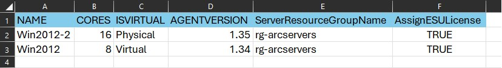

# Activation des ESU via Azure ARC

> English instructions can be found in the [README.md file](README.md).

## Introduction

Le but de ce référentiel est de faciliter la configuration rapide de vos serveurs Windows 2012/R2, garantissant qu'ils sont prêts à recevoir les prochaines mises à jour de sécurité étendues, appelées ESU.

L'activation préalable de vos serveurs Windows 2012/R2 est nécessaire pour recevoir les ESU. La non activation de vos serveurs entraînera l'impossibilité de recevoir les ESU.

> Il est crucial de bien comprendre les procédures de licence appropriées et les exigences pour les serveurs pour lesquels vous souhaitez activer les ESU (Extended Security Updates) en utilisant Azure ARC. Il est impératif de générer le BON type de licence, tel que Standard ou Datacenter, mais aussi de bien choisir le type de cœurs (virtuels ou physiques). Ne pas le faire pourrait entraîner soit une facturation excessive, soit une non-conformité avec les réglementations de licence de Microsoft. En cas de doute, veuillez consulter votre spécialiste Microsoft Azure dédié ou votre responsable de compte Microsoft.

Ces informations et scripts sont fournis "tels quels" et ne sont pas destinés à se substituer à des conseils professionnels ou à une consultation, y compris, mais sans s'y limiter, des conseils juridiques. Je ne donne aucune garantie, expresse, implicite ou légale, quant aux informations contenues dans ce document ou ces scripts. Je n'accepte aucune responsabilité pour les dommages, directs ou indirects, découlant de l'utilisation des informations contenues dans ce document ou ces scripts.

Cela étant clarifié, allons-y !

## Prérequis

Vous aurez besoin des éléments suivants pour commencer :

- Un locataire Microsoft Entra ainsi qu'un abonnement Azure actif.
- Des serveurs Windows 2012/R2 déjà intégrés à la plateforme Azure ARC. Veuillez consulter les [prérequis de l'agent Connected Machine](https://learn.microsoft.com/fr-fr/azure/azure-arc/servers/prerequisites) pour vous assurer que vos serveurs sont prêts pour l'intégration.
- Un groupe de ressources Azure pour stocker les licences ESU qui seront créées avec ces scripts.
- Une Application d'Entreprise Microsoft Entra et un service principal actif qui seront utilisés pour l'authentification Azure. Veuillez vous référer au document [Créer un service principal Microsoft Entra](https://learn.microsoft.com/fr-fr/entra/identity-platform/howto-create-service-principal-portal) pour sa création.
- L'ID de l'application Microsoft Entra et la clé secrète pour le service principal créé ci-dessus.
- Une délégation de droits sur le groupe de ressources contenant les licences, ainsi qu'une délégation de droits sur les groupes de ressources contenant les serveurs ARC Azure. Veuillez consulter la rubrique [Déléguer l'accès aux ressources Azure](https://learn.microsoft.com/fr-fr/azure/role-based-access-control/role-assignments-steps) pour déléguer l'accès aux groupes de ressources si vous avez besoin d'aide. Les droits délégués requis seront documentés dans la section suivante.
- Un ordinateur avec Powershell 7.x ou une version ultérieure installée. Veuillez consulter la page [Installer PowerShell sur Windows](https://learn.microsoft.com/fr-fr/powershell/scripting/install/installing-powershell-on-windows) pour installer Powershell 7.x ou une version ultérieure. La version actuelle des scripts n'utilise pas le module AZ Powershell, mais il est recommandé de l'installer pour une utilisation future. Veuillez consulter la page [Installer Azure PowerShell sur Windows](https://learn.microsoft.com/fr-fr/powershell/azure/install-azps-windows) pour installer le module AZ Powershell si vous le souhaitez.
 
## Droits Azure requis pour exécuter les scripts

Les droits suivants doivent être délégués sur les groupes de ressources que vous prévoyez d'utiliser pour stocker les objets de licence ESU, ainsi que sur les groupes de ressources contenant les serveurs Azure ARC:

- "Microsoft.HybridCompute/licenses/read"
- "Microsoft.HybridCompute/licenses/write"
- "Microsoft.HybridCompute/licenses/delete"
- "Microsoft.HybridCompute/machines/licenseProfiles/read"
- "Microsoft.HybridCompute/machines/licenseProfiles/write"
- "Microsoft.HybridCompute/machines/licenseProfiles/delete"

Il y a une définition de rôle personnalisé située dans le dossier "Custom Roles" de ce référentiel qui peut être utilisée pour créer un rôle personnalisé avec les droits requis. Voir [Créer un rôle personnalisé à l'aide d'Azure PowerShell](https://learn.microsoft.com/fr-fr/azure/role-based-access-control/custom-roles-powershell#create-a-custom-role-with-json-template) pour créer un rôle personnalisé avec cette définition de rôle personnalisé.

Une fois le rôle créé, assignez-le au service principal et appliquez le aux groupes de ressources.

## Comment utiliser les scripts

Il y a actuellement 4 scripts dans ce référentiel (situé dans le dossier Scripts) :

- AssignESULicense.ps1
- CreateESULicense.ps1
- CreateESULicensesFromCSV.ps1
- DeleteESULicense.ps1

### AssignESULicense.ps1

Ce script assignera une licence ESU au serveur ARC Azure spécifié. Voici la ligne de commande que vous devez utiliser pour l'exécuter :
    
    ./AssignESULicense -subscriptionId "xxxxxxxx-xxxx-xxxx-xxxx-xxxxxxxxxxxx" -tenantId "xxxxxxxx-xxxx-xxxx-xxxx-xxxxxxxxxxxx" -appID "xxxxxxxx-xxxx-xxxx-xxxx-xxxxxxxxxxxx" -clientSecret "your_application_secret_value" -licenseResourceGroupName "rg-ARC-ESULicenses" -licenseName "Standard-8vcores" -serverResourceGroupName "rg-arservers" -ARCServerName "Win2012" -location "EastUS"

où :
- subscriptionId est l'ID d'abonnement de l'abonnement Azure que vous souhaitez utiliser.
- tenantId est l'ID de locataire du locataire Microsoft Entra ID que vous souhaitez utiliser.
- appID est l'ID d'application du service principal que vous avez créé dans la section Prérequis.
- clientSecret est la clé secrète du service principal que vous avez créé dans la section Prérequis.
- licenseResourceGroupName est le nom du groupe de ressources qui contient la licence ESU que vous souhaitez assigner au serveur ARC Azure.
- licenseName est le nom de la licence ESU que vous souhaitez assigner au serveur ARC Azure.
- serverResourceGroupName est le nom du groupe de ressources qui contient le Azure serveur ARC auquel vous souhaitez assigner la licence ESU.
- ARCServerName est le nom du serveur ARC Azure auquel vous souhaitez assigner la licence ESU.
- location est la Azure région où vos objets ARC sont déployés.

Vous pouvez utiliser -u à la fin de la ligne de commande pour DISSOCIER (unlink) une licence existante d'un serveur ARC Azure. Si vous ne spécifiez pas le paramètre -u, le script assignera la licence au serveur ARC Azure (comportement par défaut).

## CreateESULicense.ps1

Ce script créera une licence ESU. Voici la ligne de commande que vous devez utiliser pour l'exécuter :
    
    ./CreateESULicense -subscriptionId "xxxxxxxx-xxxx-xxxx-xxxx-xxxxxxxxxxxx" -tenantId "xxxxxxxx-xxxx-xxxx-xxxx-xxxxxxxxxxxx" -appID "xxxxxxxx-xxxx-xxxx-xxxx-xxxxxxxxxxxx" -clientSecret "your_application_secret_value" -licenseResourceGroupName "rg-ARC-ESULicenses" -licenseName "Standard-8vcores" -location "EastUS" -state "Activated" -edition "Standard" -coreType "vCore" -coreCount 8

où :
- subscriptionId est l'ID d'abonnement de l'abonnement Azure que vous souhaitez utiliser.
- tenantId est l'ID de locataire du locataire Microsoft Entra ID que vous souhaitez utiliser.
- appID est l'ID d'application du service principal que vous avez créé dans la section Prérequis.
- clientSecret est la clé secrète du service principal que vous avez créé dans la section Prérequis.
- licenseResourceGroupName est le nom du groupe de ressources qui contient la licence ESU que vous souhaitez assigner au serveur ARC Azure.
- licenseName est le nom de la licence ESU que vous souhaitez assigner au serveur ARC Azure.
- location est la Azure région où vos objets ARC sont déployés.
- state est l'état d'activation de la licence ESU. Il peut être "Activated" ou "Deactivated.
- edition est l'édition de la licence ESU. Il peut s'agir de "Standard" ou de "Datacenter".
- coreType est le type e coeur à utiliser pour la licence ESU. Il peut s'agir de "vCore" (coeur virtuel) ou de "pCore" (coeur physique).
- coreCount est le nombre de cœurs associés la licence ESU.

Vous pouvez entrer le nombre exact de cœurs dont dispose votre hôte ou votre machine virtuelle et le script calculera automatiquement le nombre de cœurs requis pour la licence ESU.

**Remarque :** Le script peut également être réexécuté avec les mêmes paramètres de base pour changer certaines des propriétés de la licence. Ces propriétés sont les suivantes :
- state (vous permet de créer une licence désactivée et de l'activer ultérieurement)
- coreCount (vous permet de modifier le nombre de cœurs de la licence si vous avez besoin de l'augmenter ou de le diminuer)

Tous les autres paramètres sont **immuables** et ne peuvent pas être modifiés une fois la licence créée.

## CreateESULicensesFromCSV.ps1

Ce script créera des licences ESU en bloc, en prenant ses informations d'un fichier CSV.
> **Remarque : la création de licence sera ignorée si la version de l'agent Arc est inférieure à 1.34, car il s'agit de la version minimale requise capable de pousser l'activation ESU vers les serveurs. Mettez à niveau vos agents ARC, réexécutez la requête Azure Graph Explorer, puis réexécutez le script pour traiter les serveurs nouvellement mis à niveau.**

La création du fichier CSV peut être effectuée de 2 manières :
### **Manuellement**:
(en fournissant les informations requises dans le fichier CSV). 

Voici les colonnes qui doivent être présentes dans le fichier CSV :
- Nom : nom de la licence ESU qui sera créée (correspond généralement à un nom de serveur mais pas obligatoire si vous prévoyez d'utiliser des licences ESU pour couvrir plusieurs serveurs).
- Cores : nombre de cœurs de la machine virtuelle ou du serveur physique.
- IsVirtual : valeur qui indique si le serveur est virtuel ou non, soit **Virtual** pour les machines virtuelles ou **Physical** pour les serveurs physiques.

> **Remarque :** La colonne IsVirtual est seulement utilisée pour déterminer le type de noyau qui va être assigné à la licence. Vous utiliserez généralement presque toujours des licences vCore, sauf si vous couvrez des serveurs physiques.

- AgentVersion : version de l'agent ARC Azure installé sur le serveur. Ces informations peuvent être récupérées à partir du portail Azure ou en exécutant la requête [Azure De Graph Explorer](https://learn.microsoft.com/fr-fr/graph/graph-explorer/graph-explorer-overview) mentionnée ci-dessous.
- ServerResourceGroupName : nom du groupe de ressources qui contient le serveur ARC Azure auquel vous souhaitez assigner la licence ESU.
- AssignESULicense: lorsque la valeur est à **True**, la license sera automatiquement assignée au serveur ARC Azure. **False** désassociera la licence ESU du serveur ARC Azure. Enfin, si vous désirez créer une licence ESU sans l'assigner à un serveur ARC Azure, vous devez **omettre** une valeur pour la colonne AssignESULicense.

> Ces deux dernières colonnes sont **optionelles** et ne sont utiles que quand/lorsque vous voulez gérer les attrributions de licences via le fichier CSV. Notez qu'elles ne sont PAS créées automatiquement lors de la génération du fichier CSV avec Azure Graph Explorer. Vous devrez donc les ajouter **manuellement** si vous comptez les utiliser.

**Fichier CSV type**

    
### **Automatiquement**
(en exécutant la requête suivante de [Azure De Graph Explorer](https://learn.microsoft.com/en-us/graph/graph-explorer/graph-explorer-overview) et en enregistrant les données ainsi produites dans un fichier CSV) :

    Resources
    | where type == 'microsoft.hybridcompute/machines'  
    | extend agentVersion = tostring(properties.agentVersion) , operatingSystem = tostring(properties.osSku)  
    | where operatingSystem has "Windows Server 2012"  
    | extend ESUStatus = properties.licenseProfile.esuProfile.licenseAssignmentState  
    | where ESUStatus == "NotAssigned"  
    | extend Cloud = tostring(properties.cloudMetadata.provider)  
    | extend isVirtual = iff(properties.detectedProperties.model == "Virtual Machine" or properties.detectedProperties.manufacturer == "VMware, Inc." or properties.detectedProperties.manufacturer == "Nutanix" or properties.cloudMetadata.provider == "AWS" or properties.cloudMetadata.provider == "GCP", "Virtual", "Physical")  
    | extend cores = properties.detectedProperties.coreCount, model = tostring(properties.detectedProperties.model), manufacturer = tostring(properties.detectedProperties.manufacturer)  
    | project name,operatingSystem,model,manufacturer,cores,isVirtual,Cloud,ESUStatus,agentVersion
   
> **Remarque :** La requête mentionnée affichera tous les serveurs Windows 2012/R2 intégrés à Azure ARC qui n'ont pas encore reçu de licence ESU. Vous avez la possibilité d'ajuster la requête pour récupérer tous les serveurs Windows 2012/R2 et ensuite filtrer les résultats dans Excel, en ne conservant que les serveurs auxquels vous souhaitez attribuer des licences ESU. Bien que certaines des colonnes retournées puissent ne pas être utilisées par le script, elles peuvent être utiles pour le filtrage des résultats dans Excel. Assurez-vous de conserver les colonnes essentielles (comme spécifié dans le processus de création manuel mentionné précédemment) pour assurer le bon fonctionnement du script.

Assurez-vous toujours de faire un examen approfondi du contenu du fichier CSV avant son utilisation. Notez que dans de rares cas, la reqûete Azure Graph Explorer peut renvoyer une valeur 'NULL' pour les cœurs des machines analysées au lieu du nombre réel de cœurs. Si cela se produit, une intervention manuelle est nécessaire, vous obligeant à modifier le fichier CSV et à remplacer la valeur NULL par le nombre spécifique de cœurs relatifs au serveur.
 
Voici la ligne de commande que vous devez utiliser pour l'exécuter :

Here is the command line you should use to run it:
    
    ./CreateESULicensesFromCSV.ps1 -subscriptionId "xxxxxxxx-xxxx-xxxx-xxxx-xxxxxxxxxxxx" -tenantId "xxxxxxxx-xxxx-xxxx-xxxx-xxxxxxxxxxxx" -appID "xxxxxxxx-xxxx-xxxx-xxxx-xxxxxxxxxxxx" -clientSecret "your_application_secret_value" -licenseResourceGroupName "rg-ARC-ESULicenses" -location "EastUS" -state "Deactivated" - edition "Standard" -csvFile "C:\foldername\ESULicenses.csv" 

où :
- subscriptionId est l'ID d'abonnement de l'abonnement Azure que vous souhaitez utiliser.
- tenantId est l'ID de locataire du locataire Microsoft Entra ID que vous souhaitez utiliser.
- appID est l'ID d'application du service principal que vous avez créé dans la section Prérequis.
- clientSecret est la clé secrète du service principal que vous avez créé dans la section Prérequis.
- licenseResourceGroupName est le nom du groupe de ressources qui contiendra les licences ESU.
- location est la Azure région où vos objets ARC sont déployés.
- state est l'état d'activation de la licence ESU. Il peut être "Activated" ou "Deactivated.
- edition est l'édition de la licence ESU. Il peut s'agir de "Standard" » ou de "Datacenter".
- csvFile est le nom du fichier CSV qui contient les informations sur les licences ESU que vous voulez créer.

**Remarque**: vous pouvez utiliser des paramètres facultatifs pour ajouter un préfixe et/ou un suffixe au nom de licence qui sera créée. Par exemple, si vous spécifiez « ESU- » comme préfixe et « -marketing » comme suffixe, le script créera des licences nommées « ESU-ServerName-marketing » pour chaque serveur dans le fichier CSV. Cela peut vous aider à différencier les licences appartenant à différents départements ou unités commerciales par exemple.

- licenseNamePrefix (facultatif) est le préfixe qui sera utilisé pour créer les licences ESU. Le script concaténera le préfixe avec le contenu du champ "Name" trouvé dans le fichier CSV pour créer le nom de la licence.
- licenseNameSuffix (facultatif) est le suffixe qui sera utilisé pour créer les licences ESU. Le script concaténera le suffixe avec le contenu du champ "Name" trouvé dans le CSV pour créer le nom de la licence.

**Remarque**: vous pouvez utiliser les paramètres facultatifs -log pour spécifier un chemin d'accès à un fichier journal.

## DeleteESULicense.ps1

Ce script supprimera une licence ESU. Lorsque vous supprimez une licence, elle est supprimée du serveur ARC Azure auquel elle a été affectée et arrête la facturation liée à cette licence.

> **La suppression d'une licence activée puis sa recréation sont FORTEMENT DÉCONSEILLÉES. En effet, toutes les licences activées entraîneront les frais mensuels de l'ESU à compter du 10 octobre 2023. Si vous supprimez une licence et que vous la recréez par la suite, la nouvelle licence vous sera facturée à partir du 10 octobre 2023, plutôt qu'à partir du moment de sa création ou de son activation initiale. Cette opération de suppression/recréation impliquera une double facturation temporaire.**

Voici la ligne de commande que vous devez utiliser pour l'exécuter :
    
    ./DeleteESULicense -subscriptionId "xxxxxxxx-xxxx-xxxx-xxxx-xxxxxxxxxxxx" -tenantId "xxxxxxxx-xxxx-xxxx-xxxx-xxxxxxxxxxxx" -appID "xxxxxxxx-xxxx-xxxx-xxxx-xxxxxxxxxxxx" -clientSecret "your_application_secret_value" -licenseResourceGroupName "rg-ARC-ESULicenses" -licenseName "Standard-8vcores"

où :
- subscriptionId est l'ID d'abonnement de l'abonnement Azure que vous souhaitez utiliser.
- tenantId est l'ID de locataire du locataire Microsoft Entra ID que vous souhaitez utiliser.
- appID est l'ID d'application du service principal que vous avez créé dans la section Prérequis.
- clientSecret est la clé secrète du service principal que vous avez créé dans la section Prérequis.
- licenseResourceGroupName est le nom du groupe de ressources qui contiendra les licences ESU.
- licenseName est le nom de la licence ESU que vous souhaitez supprimer.

## License

Ce projet est sous licence selon les termes de la licence MIT. Voir le [fichier LICENSE](LICENSE).
