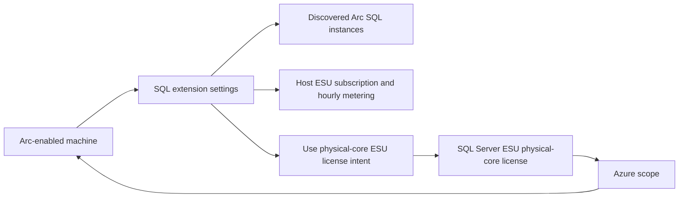

# SQL Server ESUs through Azure Arc: research and implementation plan

Research date: 2026-09-03

## Executive conclusion

SQL Server Extended Security Update (ESU) subscriptions can be managed programmatically for SQL Server enabled by Azure Arc, but they do **not** use the Windows Server ESU license and license-profile model already implemented in this repository.

There are two separate SQL Server management paths:

1. **Per-host ESU subscription**: update the Azure Extension for SQL Server resource on an Arc-enabled machine. The controlling resource is `Microsoft.HybridCompute/machines/extensions`, normally named `WindowsAgent.SqlServer` or `LinuxAgent.SqlServer`. The documented settings include `LicenseType`, `enableExtendedSecurityUpdates`, and `esuLastUpdatedTimestamp`.
2. **Physical-core ESU license with unlimited virtualization**: create and manage a `Microsoft.AzureArcData/sqlServerEsuLicenses` resource, then configure each eligible Arc-enabled VM in scope to subscribe to ESUs and use that physical-core license.

`Microsoft.AzureArcData/sqlServerInstances` resources are discovered SQL inventory and status resources. They identify version, edition, host, connectivity, and usage timestamps, but the current schema does not expose the host-level ESU subscription switch. Automation must not try to apply an ESU subscription by patching an individual `sqlServerInstances` resource.

As of the research date:

- SQL Server 2014 and SQL Server 2016 are the only currently documented SQL Server releases eligible for the current ESU offer.
- SQL Server 2012 and earlier aren't eligible for the current offer and aren't supported by the current Azure Extension for SQL Server.
- No current Microsoft source documents a fourth or later ESU year for SQL Server 2014 or SQL Server 2016. Both have three-year programs.
- A REST-first repository design is feasible for host subscriptions by reading, merging, and replacing extension settings. This preserves the repository's current direct ARM REST approach.
- SQL Server 2016 physical-core ESU licenses require `2026-03-01-preview` based on the current Azure resource schema. The stable `2026-01-01` schema enumerates only SQL Server 2012 and SQL Server 2014.
- Microsoft documentation currently contains conflicting property names, values, dates, and permission strings. Those discrepancies must be resolved with mocked contract tests and a non-mutating tenant preflight before implementing a live SQL Server 2016 physical-core workflow.

## Scope

This report covers:

- Currently eligible out-of-support SQL Server versions.
- Arc onboarding and Azure Extension for SQL Server prerequisites.
- ESU eligibility and license-type requirements.
- Programmatic enrollment, status, cancellation, billing, and update delivery.
- Per-host core metering and physical-core unlimited virtualization.
- High availability and disaster recovery (HA/DR).
- Migration and resource-move implications.
- Direct REST, Azure CLI, Az PowerShell, and Azure Policy tradeoffs.
- A separate SQL-specific script, CSV, test, documentation, and RBAC design for this repository.

This is research and planning only. It does not authorize or perform any Azure mutation.

## Current version and lifecycle matrix

| SQL Server release | Status on 2026-09-03 | Current ESU period | Documented ESU end | Arc implementation decision |
| --- | --- | --- | --- | --- |
| SQL Server 2016 (13.x) | Out of extended support; ESU Year 1 | Year 1 began in July 2026 | July 17, 2029 | Support in the proposed SQL workflows |
| SQL Server 2014 (12.x) | Out of extended support; ESU Year 3 | Year 3 began in July 2026 | July 2027; official pages disagree on the exact day | Support in the proposed SQL workflows |
| SQL Server 2012 (11.x) | ESU period expired; explicitly excluded by current SQL Arc prerequisites | None | Not in the current offer | Reject before authentication or mutation |
| SQL Server 2008/R2 and earlier | ESU period expired | None | Not in the current offer | Reject before authentication or mutation |

The current [SQL Server ESU FAQ](https://learn.microsoft.com/sql/sql-server/end-of-support/extended-security-updates-frequently-asked-questions?view=sql-server-ver17) says SQL Server 2014 ESUs are available until July 8, 2027 and SQL Server 2016 ESUs until July 17, 2029. The [Microsoft Lifecycle FAQ](https://learn.microsoft.com/lifecycle/faq/sql-server-extended-security-updates) lists the SQL Server 2014 Year 3 end as July 12, 2027, while the [SQL Server 2014 lifecycle page](https://learn.microsoft.com/lifecycle/products/sql-server-2014) lists a Pacific-time release interval ending July 13, 2027. The repository must not encode the disputed SQL Server 2014 day as a validation boundary until Microsoft reconciles these pages.

The [SQL Server 2016 lifecycle page](https://learn.microsoft.com/lifecycle/products/sql-server-2016) lists ESU Year 1 from July 15, 2026 through July 13, 2027. The Arc ESU article describes the support period as starting July 14, while the SQL FAQ says billing starts at midnight UTC on July 15. Do not implement a local date calculation for billing eligibility. Read current Azure state and show source-qualified billing guidance instead.

The current [SQL Server ESU overview](https://learn.microsoft.com/sql/sql-server/end-of-support/sql-server-extended-security-updates?view=sql-server-ver17) and FAQ apply only to SQL Server 2014 and SQL Server 2016. The FAQ explicitly directs SQL Server 2012 and earlier users to upgrade. Historical Azure-only extensions for older SQL releases don't create a current entitlement.

## Eligibility and prerequisites

### SQL release, architecture, and edition

The current [Arc SQL prerequisites](https://learn.microsoft.com/sql/sql-server/azure-arc/prerequisites?view=sql-server-ver17) support 64-bit SQL Server 2014 and later. The current ESU offer applies to SQL Server 2014 and SQL Server 2016.

Production ESU subscriptions are available for Standard and Enterprise editions. Express, Web, and Developer editions can't independently establish production entitlement. A Developer-only host can subscribe for nonproduction use at a $0 Developer meter when the customer has qualifying production ESU coverage. Standard and Enterprise hosts in a qualifying Azure dev/test subscription can also have their meters nullified. If a Developer instance shares a host with an eligible Standard or Enterprise instance of the same version, the production edition drives billing. Automation must distinguish production from nonproduction enrollment and require the customer to attest to the applicable coverage; it can't infer entitlement from edition alone.

The SQL FAQ requires the latest applicable service pack. The ESU overview further says SQL Server 2014 and 2016 ESUs include the most recent cumulative update, and recommends installing and validating the latest CU when a server previously followed only the GDR branch. The proposed preflight should report patch level but must not automatically patch SQL Server.

### Operating system and hosting environment

Current Azure Extension for SQL Server support includes:

- Windows Server 2016 and later.
- Windows 10 and Windows 11.
- Supported Ubuntu 20.04, RHEL 8, and SLES 15 x64 releases.

Current prerequisites exclude Windows Server versions earlier than 2016, SQL Server 2012 and earlier, containers, Business Intelligence edition, SQL Server on Azure VMs, and several other configurations. SQL Server on Azure VMs uses the SQL IaaS Agent extension instead of this Arc workflow.

Linux support for the Azure Extension for SQL Server is currently preview. Linux doesn't support automatic passive-instance detection; all SQL Server instances on Linux are billed as active for PAYG and ESU purposes. Automatic updates through the Arc SQL feature currently work only on Windows hosts.

The physical-core unlimited-virtualization benefit isn't available on infrastructure from Microsoft's listed providers. On such infrastructure, a physical-core intent is ignored and the VM remains subject to virtual-core billing.

### Azure Arc and extension prerequisites

Before ESU enrollment:

1. The machine must be connected to Azure Arc with the Connected Machine agent in full mode.
2. The `Microsoft.HybridCompute` and `Microsoft.AzureArcData` resource providers must be registered.
3. The Azure Extension for SQL Server must be installed and healthy:
   - `WindowsAgent.SqlServer` on Windows.
   - `LinuxAgent.SqlServer` on Linux.
   - Publisher: `Microsoft.AzureData`.
4. `SqlManagement.IsEnabled` must be `true` so installed SQL instances are discovered.
5. The Arc machine and Arc SQL resources must use the same Azure region and resource group.
6. At least one discovered `Microsoft.AzureArcData/sqlServerInstances` resource must report an eligible version and either a Standard or Enterprise production edition, or Developer/nonproduction coverage confirmed through the `ConfirmNonProductionCoverage` gate.
7. The extension version must have been released within the preceding 12 months. Microsoft supports only extension versions in that window. On the research date, the [release notes](https://learn.microsoft.com/sql/sql-server/azure-arc/release-notes?view=sql-server-ver17) identify `1.1.3518.465` as the current auto-upgrade target.

Do not hardcode `1.1.3518.465` as a permanent minimum. The preflight should compare release dates or advise automatic extension upgrade based on current first-party documentation.

### Network and local permissions

The machine needs the general Azure Arc network endpoints plus outbound TCP 443 access to `*.<region>.arcdataservices.com`. Current prerequisites also require access to `aka.ms` and `*.web.core.windows.net`. Private Link isn't supported for the Arc data processing service endpoint.

Installation requires local administrator or root access. Current onboarding documentation also requires subscription read access and resource-group permissions including Azure Connected Machine Onboarding, `Microsoft.AzureArcData/register/action`, and Hybrid Compute machine-extension read/write actions.

The SQL extension needs local SQL permissions. Current prerequisites describe `NT AUTHORITY\SYSTEM` requirements during deployment and least-privilege behavior for newer extension releases. Automation should assess and report these prerequisites, not silently grant SQL logins or server roles.

### License type

The host extension's `LicenseType` must be one of:

- `PAYG`: pay-as-you-go SQL software license.
- `Paid`: license with active Software Assurance or an active SQL Server subscription.
- `LicenseOnly`: perpetual license or free edition without the qualifying subscription benefit.

Arc-enabled ESUs require `PAYG` or `Paid`. `LicenseOnly` doesn't qualify. A Server+CAL installation must normally report `LicenseOnly` and can't use the Arc ESU subscription unless the customer explicitly changes to `PAYG`. The scripts must never infer a license type from edition, agreement, or existing billing behavior.

## Azure resource model



| Resource | Role in SQL ESU | Writable ESU data |
| --- | --- | --- |
| `Microsoft.HybridCompute/machines` | Arc host identity, location, connectivity, host metadata, and VMID | No SQL ESU switch |
| `Microsoft.HybridCompute/machines/extensions` | Azure Extension for SQL Server configuration | `LicenseType`, host ESU enablement, timestamp, physical-core intent, and other extension settings |
| `Microsoft.AzureArcData/sqlServerInstances` | Discovered SQL inventory and status | Not the current host ESU subscription control plane |
| `Microsoft.AzureArcData/sqlServerEsuLicenses` | Physical-core ESU license for unlimited virtualization | Version, scope, billing plan, cores, and activation state |

The ESU subscription setting is host-scoped. Enabling it on one SQL extension can cover all eligible instances on that operating system environment. If SQL Server 2014 and SQL Server 2016 are both installed, each eligible version reports a separate ESU meter. A future CSV must therefore identify the Arc machine, not pretend that each instance receives an independent extension setting.

## Programmatic host subscription

### Recommended REST contract

Use the stable Hybrid Compute machine-extension API independently from Azure Arc Data APIs:

```http
GET https://management.azure.com/subscriptions/{subscriptionId}/resourceGroups/{resourceGroupName}/providers/Microsoft.HybridCompute/machines/{machineName}/extensions/{extensionName}?api-version=2026-07-15
```

Then merge the desired SQL settings into the returned writable extension representation and replace the extension:

```http
PUT https://management.azure.com/subscriptions/{subscriptionId}/resourceGroups/{resourceGroupName}/providers/Microsoft.HybridCompute/machines/{machineName}/extensions/{extensionName}?api-version=2026-07-15
```

The current [machine-extension REST reference](https://learn.microsoft.com/rest/api/hybridcompute/machine-extensions/create-or-update?view=rest-hybridcompute-2026-07-15) requires `location` and accepts extension `publisher`, `type`, `typeHandlerVersion`, upgrade flags, and an open JSON `settings` object. Keep this API version independent from the Arc Data resource versions and revalidate it before implementation.

The documented host enrollment settings are equivalent to:

```powershell
$updatedSettings = @{
    SqlManagement = @{ IsEnabled = $true }
    LicenseType = 'PAYG' # Or Paid, chosen explicitly by the customer.
    enableExtendedSecurityUpdates = $true
    esuLastUpdatedTimestamp = [DateTime]::UtcNow.ToString('yyyy-MM-ddTHH:mm:ss.fffZ')
}
```

This is illustrative, not an implementation. The actual workflow must:

1. GET the extension.
2. Verify publisher, extension type, location, and provisioning state.
3. Deep-copy all existing public settings, including excluded instances and unrelated enabled features.
4. Change only the explicitly requested `LicenseType`, `enableExtendedSecurityUpdates`, `esuLastUpdatedTimestamp`, and, after contract confirmation, physical-core ESU setting.
5. Exclude response-only fields such as `instanceView` and `provisioningState` from the PUT body.
6. Display the old and new billing-sensitive values.
7. Require `ShouldProcess`; require an additional explicit billing acknowledgement when enabling, re-enabling, changing license type, or falling back from physical-core to host billing.
8. Poll the asynchronous operation when ARM returns `202 Accepted`, then GET and verify the effective settings and extension health.

This read-merge-write pattern is mandatory. Microsoft's generic `az connectedmachine extension update --settings` warning says the settings object is overwritten. Sending only the ESU fields can erase excluded-instance lists or configuration for other SQL Arc features.

### Enable and cancel

- Enable: set `enableExtendedSecurityUpdates` to Boolean `true` and refresh `esuLastUpdatedTimestamp`.
- Cancel: set it to Boolean `false` and refresh the timestamp.
- License type: preserve the current value unless the customer explicitly requests `PAYG` or `Paid` and acknowledges the consequences.
- `LicenseOnly`: reject enablement before mutation.

The current Learn example uses a PowerShell Boolean for `enableExtendedSecurityUpdates`, while some Resource Graph examples compare the reported setting with the string `'true'`. The implementation should write a JSON Boolean and accept Boolean or case-insensitive string forms when reading legacy state. A mocked request-body test must lock this behavior.

### Status

A reliable status command should correlate three reads:

1. Arc machine: location, connection status, VMID, operating system, detected cores, and last connection state.
2. SQL extension: provisioning state, handler version, `LicenseType`, ESU setting, last-updated timestamp, excluded instances, and physical-core setting/application state.
3. Arc SQL instances linked by `properties.containerResourceId`: version, edition, service type, status, host type, vCore/core inventory, patch level, `lastInventoryUploadTime`, and `lastUsageUploadTime`.

For a physical-core license, also GET or list `Microsoft.AzureArcData/sqlServerEsuLicenses` resources and calculate whether the machine lies within the declared Azure scope. Scope membership alone is not proof of coverage; the extension must report that physical-core intent is applied.

The status object should distinguish:

- Requested configuration.
- Extension provisioning health.
- Eligible discovered instances.
- Current connection and upload freshness.
- Metering basis.
- Physical-core license scope and activation state.
- Unknown or contradictory state requiring portal/support verification.

## Physical-core ESU licenses

### Purpose and billing

`Microsoft.AzureArcData/sqlServerEsuLicenses` implements the Enterprise-edition unlimited-virtualization benefit. It doesn't license Standard edition by physical cores and doesn't accept virtual cores. The license is billed on an hourly PAYG ESU meter and has a 16-physical-core minimum.

One resource can cover qualified Arc-enabled VMs in a resource-group, subscription, or tenant scope. Every intended VM must be Arc-connected, be in scope, subscribe to ESUs, and be configured to use the physical-core ESU license. Overlapping license scopes are allowed and therefore require explicit duplicate-cost review.

### REST resources and versions

The resource URI is:

```http
https://management.azure.com/subscriptions/{subscriptionId}/resourceGroups/{resourceGroupName}/providers/Microsoft.AzureArcData/sqlServerEsuLicenses/{licenseName}?api-version={apiVersion}
```

The current [Arc Data REST operation group](https://learn.microsoft.com/rest/api/arcdata/sql-server-esu-licenses) documents Create, Get, List, List by resource group, Update, and Delete under stable API `2026-01-01`.

Use API versions per target version:

| License version | Proposed API | Reason |
| --- | --- | --- |
| SQL Server 2014 | `2026-01-01` | Stable schema supports SQL Server 2014 |
| SQL Server 2016 | `2026-03-01-preview` | First current schema that enumerates SQL Server 2016 |

The [stable schema](https://learn.microsoft.com/azure/templates/microsoft.azurearcdata/2026-01-01/sqlserveresulicenses) still enumerates SQL Server 2012 and SQL Server 2014. The [preview schema](https://learn.microsoft.com/azure/templates/microsoft.azurearcdata/2026-03-01-preview/sqlserveresulicenses) adds SQL Server 2016. Although SQL Server 2012 remains in these resource schemas, current SQL Arc prerequisites and the current ESU FAQ exclude it. Schema acceptance isn't proof of current entitlement.

Create or replace uses PUT with a body shaped as:

```json
{
  "location": "<supported-region>",
  "properties": {
    "activationState": "Active",
    "billingPlan": "PAYG",
    "physicalCores": 32,
    "scopeType": "ResourceGroup",
    "version": "SQL Server 2016"
  }
}
```

The current configuration article contains an older example using API `2024-03-01-preview` and version value `2014`, while the current provider catalog doesn't expose that API and current schemas require values such as `SQL Server 2014`. The proposed implementation must follow the versioned provider schema, not copy that older example.

Update uses PATCH in the current configuration guidance. Read the existing resource, preserve required properties, and change only a permitted property. Delete is exposed by the REST operation group, but termination and deletion are separate states and must not be treated as interchangeable billing operations.

### Lifecycle restrictions

After activation:

- Version can't change.
- Scope can't change.
- Physical core count can decrease but can't increase.
- Increasing capacity requires another license resource.

After termination:

- The license can't be reactivated.
- The resource can be deleted if no longer needed.
- Subscribed VMs in scope remain subscribed and become individually billable.

To stop all ESU charges, unsubscribe affected VMs before terminating the physical-core license. Automation should enumerate and display in-scope machines, block termination unless their intended post-termination billing is explicit, and require a dedicated irreversible-action confirmation.

### Unresolved physical-core extension property

Current Microsoft pages use inconsistent names:

- `UseEsuPhysicalCoreLicense`
- `UsePhysicalEsuCoreLicense`
- Reported `UseEsuPhysicalCoreLicense.IsApplied`
- Related SQL software licensing setting `UsePhysicalCoreLicense.IsApplied`

The generic extension schema intentionally treats `settings` as open JSON and doesn't resolve this discrepancy. Do not ship a physical-core assignment mutation until one of these checks confirms the writable setting:

1. A GET of a portal-configured test extension in a nonproduction tenant.
2. The current `az sql server-arc extension set/show` implementation or response.
3. A corrected first-party Microsoft contract or sample.

This is the principal unresolved implementation blocker. It doesn't block per-host ESU subscription planning.

## Billing and cancellation behavior

### Per-host metering

Ordinary host subscriptions don't accept a caller-supplied core count. The SQL extension detects the host type, cores visible to the operating system environment (OSE), SQL version, and highest eligible edition.

- VM: all vCores visible to the OSE, minimum four.
- Physical server without VMs: all physical cores visible to the OSE, minimum four.
- Multiple eligible instances of the same version on one OSE: one meter based on the highest edition.
- Eligible instances of different versions on one OSE: separate metering for each eligible version.
- Standard edition: maximum billable/usable core limit follows the documented 24-core edition limit.
- Qualifying passive HA/DR host: $0 disaster-recovery meter.

Scripts must not ask customers to type a per-host core count. The detected count belongs in preflight output so the customer can evaluate likely billing.

### Back-billing

Late enrollment produces a bill-back charge to the beginning of the current ESU year. Prior ESU years still require coverage. Transitioning from Volume Licensing without all prior-year coverage requires coordination with the Microsoft account team or a support request.

Re-enabling after cancellation or reconnecting after an interruption can also cause bill-back. A preview must never label enablement as simply “starting hourly billing now.” It must disclose the applicable current-year back-billing risk.

### Cancellation and disconnection

Manual cancellation stops future charges immediately and removes access to future patches. Reactivation within 30 days while the server remains connected bills back to the last active hour. After 30 days, the old subscription is terminated and re-enabling creates a new subscription.

Connectivity loss suspends billing. Reconnection within 30 days reactivates and bills the disconnected period. A longer disconnection can terminate the subscription; the portal setting can remain enabled, so reconnection may be treated as a new subscription.

VMID, resource URI, resource group, subscription, name, and region changes can affect identity and billing. A VMID change can create double billing if the old resource remains subscribed. Moving a machine to another Azure location terminates the subscription. The status command should highlight stale original resources and changed identifiers where evidence is available.

### Upgrade and migration

Microsoft says ESU charges stop automatically when SQL Server upgrades to a supported version or migrates to Azure. Scripts should still verify the resulting state and surface stale Arc resources because automatic business behavior doesn't guarantee immediate local inventory cleanup.

Moving Arc SQL resources across resource groups or subscriptions doesn't move a physical-core ESU license. A new physical-core ESU license can trigger a new bill-back charge. VMs moved outside the old license scope become individually billable while their ESU subscription remains enabled.

## HA/DR behavior

The Azure Extension for SQL Server automatically detects qualifying passive availability-group and failover-cluster instances when host `LicenseType` is `Paid` or `PAYG`. A passive host can remain subscribed so it receives future ESUs while emitting a $0 DR meter.

All SQL instances on the OSE must meet the passive criteria. Important exclusions and limitations include:

- A primary replica doesn't qualify.
- A readable secondary with active user connections doesn't qualify.
- Standalone databases outside the availability group disqualify the OSE.
- Running associated services can disqualify an otherwise passive host.
- Log shipping and database mirroring aren't automatically detected.
- DR testing isn't recognized as free passive use.
- Checks occur hourly, so a failover within an hour might temporarily meter both replicas.
- Linux has no automatic passive detection and is billed as active.

For qualifying failovers, the extension switches billing to the active replica without a new bill-back charge. The repository should report extension-detected role and meter state; it must not independently declare a host passive from a customer-provided CSV field.

## Update delivery

ESU enrollment establishes entitlement. It isn't itself a general patch deployment engine.

SQL ESU patches are released only when needed for vulnerabilities rated Critical. They use regular channels such as Microsoft Update, Windows Update, Configuration Manager, and Azure Update Manager, and can be downloaded through the Azure portal.

Instances with automatic updates enabled receive eligible updates automatically. Arc SQL automatic updates currently:

- Work only on Windows hosts.
- Operate at host level for all installed SQL instances.
- Use a configured maintenance window.
- Apply Windows, SQL Server, and Microsoft updates rated Important or Critical.
- Require `Paid` or `PAYG` licensing.

The planned scripts should report whether automatic updates are enabled and link to the current guidance. They should not silently enable patching as a side effect of ESU enrollment.

## Programmatic method comparison

| Method | Strengths | Risks or limitations | Recommendation |
| --- | --- | --- | --- |
| Direct ARM REST | Matches this repository; supports both auth paths; exact request/response control; easy to mock | Must preserve open extension settings and poll async operations; physical-core naming discrepancies remain | Primary implementation |
| `az sql server-arc extension set/show` | High-level `--esu-enabled` switch reduces payload handling | `arcdata` CLI extension and command group are preview; adds a dependency | Document as a useful reference/fallback, not the repository runtime |
| Generic `az connectedmachine extension update` | Official and broadly available | Overwrites the settings object unless caller supplies everything | Don't use as the bulk implementation pattern |
| Az PowerShell `New-AzConnectedMachineExtension` | Official example and familiar PowerShell object input | Still requires complete settings preservation; module dependency differs from current repository | Document, but retain direct REST |
| Official bulk PowerShell sample | Preserves existing settings and supports broad scopes | External script lifecycle and interface don't match this repository | Use as behavioral evidence and comparison |
| Azure Policy | Continuous at-scale enrollment of eligible machines | Broad scope can activate billing immediately; remediation identity and governance required | Offer as an explicitly governed alternative |

The preview [`az sql server-arc extension set`](https://learn.microsoft.com/cli/azure/sql/server-arc/extension?view=azure-cli-latest#az-sql-server-arc-extension-set) command exposes `--esu-enabled` and `--license-type`. It is the only documented high-level CLI abstraction found that materially reduces direct manipulation of extension settings. REST remains preferred because the repository already has tested authentication, dry-run, and request-mocking infrastructure.

## Comparison with this repository's Windows ESU model

| Concern | Windows Server ESU implementation | SQL Server ESU implementation |
| --- | --- | --- |
| Primary entitlement resource | `Microsoft.HybridCompute/licenses` | SQL extension setting on `Microsoft.HybridCompute/machines/extensions` |
| Assignment | Machine `licenseProfiles/default.assignedLicense` | Host extension setting; no Windows-style assigned-license profile |
| Physical-core pooled license | Existing Windows license object with Windows target/core properties | Separate `Microsoft.AzureArcData/sqlServerEsuLicenses` for Enterprise unlimited virtualization |
| Scope | Explicit license linked to machines | Per-host subscription, or resource-group/subscription/tenant scope plus per-VM opt-in for physical-core license |
| Core input | Customer supplies and validates licensed cores | Host subscription uses extension-detected OSE cores; caller supplies cores only for physical-core license |
| Minimum cores | Existing Windows rules: eight VM or 16 physical, even counts | Four per OSE for host subscription; 16 physical cores for unlimited-virtualization license |
| Version/year | Target and program-year license properties | Extension detects installed eligible versions; different versions meter separately |
| Billing transition | License activation/program-year model | Hourly subscription with current-year bill-back and 30-day cancellation/connectivity behavior |
| Status | License plus machine license profile | Machine, SQL extension, Arc SQL inventory, and optional physical-core license correlation |
| Update delivery | Windows ESU entitlement through Arc | SQL entitlement plus regular patch channels; automatic installation is separately configurable |

Reusable repository patterns:

- Dual authentication support.
- Explicit subscription-aware ARM resource IDs.
- PowerShell objects serialized with `ConvertTo-Json` at an explicit depth.
- Full CSV preflight before authentication or mutation.
- Read-only Azure access checks before execution.
- `DryRun`, `WhatIf`, `Confirm`, normalized execution plans, summaries, and nonzero failure exits.
- Pagination and mocked REST tests with exact URI/body assertions.
- English/French documentation parity and secret scanning.

Windows-specific mechanics that must not be reused:

- `targetOS`, Windows edition/core-type combinations, and Windows program-year arrays.
- Windows license limits or resource-group counts unless SQL documentation independently establishes them.
- License-profile assignment and unlink operations.
- Windows agent-version thresholds.
- Windows billing and activation-state assumptions.

## Proposed repository design

Keep SQL workflows separate from existing Windows scripts and CSV schemas.

### Proposed scripts

1. `Scripts/TestSQLServerArcESUPrerequisites.ps1`
   - Read-only assessment for one machine or CSV input.
   - Checks machine, extension, SQL inventory, eligibility, provider registration, location alignment, extension support window, upload freshness, and license type.
   - Doesn't install the Connected Machine agent, change local SQL permissions, or mutate Azure.
2. `Scripts/SetSQLServerESUSubscription.ps1`
   - Single-host enable or disable.
   - Supports an explicit license-type change only when requested.
   - Uses GET-merge-PUT and verifies the result.
3. `Scripts/CheckSQLServerESUStatus.ps1`
   - Correlates machine, extension, SQL instances, and optional physical-core licenses.
   - Produces stable output objects suitable for CSV export.
4. `Scripts/ManageSQLServerESUSubscriptions.ps1`
   - Bulk CSV enable/disable with full-plan validation.
   - Refuses duplicate machine actions and partial execution.
5. `Scripts/ManageSQLServerESULicenses.ps1`
   - Separate physical-core license create, update, terminate, delete, get, and list workflow.
   - Applies version-specific API selection.
   - Blocks SQL Server 2016 live operations until the preview API and physical-core extension property have passed an approved nonproduction contract check.

Automatic Arc onboarding shouldn't be hidden inside an ESU billing command. The prerequisite script can identify missing Arc/SQL extension state and point to [deployment options](https://learn.microsoft.com/sql/sql-server/azure-arc/deployment-options?view=sql-server-ver17). A later, separately approved onboarding script could install the SQL extension on an already Arc-enabled machine. Installing the Connected Machine agent on an unmanaged server requires target-machine execution, local administrator access, and additional operational design outside the current repository's ARM-only scope.

### Proposed CSV schemas

Host subscription CSV:

```text
MachineSubscriptionId,MachineResourceGroup,MachineName,Action,LicenseType,Environment,AcceptBackBilling,ConfirmNonProductionCoverage
```

- `Action`: `Enable` or `Disable`.
- `LicenseType`: empty to preserve, or explicit `PAYG`/`Paid`.
- `Environment`: `Production` or `NonProduction`; it must match the customer's licensing intent.
- `AcceptBackBilling`: explicit Boolean acknowledgement required for enable/re-enable.
- `ConfirmNonProductionCoverage`: required for nonproduction enrollment because the script can't prove qualifying production ESU coverage or dev/test subscription rights from SQL edition alone.
- Version, edition, host type, core count, and passivity must be discovered, not trusted from CSV.

Physical-core license CSV:

```text
SubscriptionId,ResourceGroupName,LicenseName,Location,Action,Version,BillingPlan,PhysicalCores,ScopeType,AcceptBilling
```

- `Action`: `CreateInactive`, `CreateActive`, `DecreaseCores`, `Terminate`, or `Delete`.
- `Version`: `SQL Server 2014` or `SQL Server 2016`.
- `BillingPlan`: `PAYG`. Although the generic resource schema also enumerates `Paid`, current SQL ESU product guidance says the physical-core ESU license uses PAYG billing.
- `PhysicalCores`: integer, minimum 16. Do not infer an even-core restriction unless a controlling Microsoft contract documents one for the selected API version.
- `ScopeType`: `ResourceGroup`, `Subscription`, or `Tenant`.
- Scope changes, version changes, reactivation, and core increases must be rejected.

Do not combine these schemas. A machine subscription and a physical-core license have different lifecycles, billing risks, and API versions.

### Proposed documentation and samples

Add matching English and French guides only when implementation begins:

- `docs/English/TestSQLServerArcESUPrerequisites.md`
- `docs/English/SetSQLServerESUSubscription.md`
- `docs/English/CheckSQLServerESUStatus.md`
- `docs/English/ManageSQLServerESUSubscriptions.md`
- `docs/English/ManageSQLServerESULicenses.md`
- Identically named files under `docs/Français/`.
- Separate sample CSVs under `samples/`.

Root READMEs should present Windows Server and SQL Server as separate product paths and avoid suggesting that one license object can cover both.

### Proposed authorization design

Create a SQL-specific least-privilege custom role after validating current provider operations. At minimum, the design is expected to need:

- Arc machine read.
- Hybrid Compute machine-extension read/write.
- Azure Arc Data SQL instance read.
- Azure Arc Data SQL ESU license read/write/delete for physical-core workflows.
- Subscription/resource-group read for scope validation.
- Resource provider registration only in a separately privileged prerequisite workflow.

The current configuration article lists `Microsoft.AzureArcData/SqlLicenses/read` and `/write` even though the resource is named `sqlServerEsuLicenses`. Treat that permission text as unresolved. Before adding a role JSON file, inspect `Microsoft.AzureArcData/operations` in a tenant and confirm the exact action names. Do not broaden to Contributor merely to bypass the discrepancy.

## Validation and safety rules

All customer-provided rows must validate before authentication or mutation.

### Host subscription validation

- Validate subscription GUID, resource-group name, and 1-54 character Arc machine name.
- Reject duplicate machines and contradictory actions.
- Require `Enable` or `Disable` only.
- Allow empty license type only to preserve current state.
- Reject `LicenseOnly` for enablement.
- Require explicit back-billing acknowledgement for enable/re-enable.
- Verify machine exists and is connected.
- Verify supported OS and matching Azure location.
- Verify SQL extension exists, is supported, and reports success.
- Verify either an eligible 64-bit SQL Server 2014/2016 Standard or Enterprise production instance, or a Developer/nonproduction configuration with explicit coverage confirmation.
- Reject Developer as a production subscription, but don't reject a confirmed qualifying nonproduction Developer host.
- Warn on mixed eligible versions because both meter separately.
- Warn or block on stale inventory/usage upload timestamps.
- Report Linux preview and active-billing limitations.
- Preserve all unmodified extension settings.

### Physical-core validation

- Validate resource name against `^[-\w\._\(\)]+$`.
- Require an integer physical-core count of at least 16 and apply only additional constraints documented by the selected API version's authoritative schema.
- Require `ResourceGroup`, `Subscription`, or `Tenant` scope.
- Reject listed-provider infrastructure.
- Reject Standard-edition assumptions; this license uses the Enterprise meter.
- Select API by SQL version and disclose preview use for 2016.
- Verify no conflicting or overlapping license produces unintended duplicate cost.
- For activation, enumerate intended VMs and verify Arc, scope, ESU subscription, and physical-core intent.
- For termination, enumerate all in-scope subscribed VMs and show their post-termination individual billing state.
- Reject core increases, scope/version changes after activation, and reactivation after termination.
- Require a dedicated irreversible termination acknowledgement.

### Execution controls

- Keep `DryRun` read-only and complete all feasible ARM GET/list checks.
- Use standard `SupportsShouldProcess`, `WhatIf`, and `Confirm`.
- Display a normalized plan including current state, requested state, detected cores, eligible versions, likely meter basis, back-billing warning, API version, and preview status.
- Require explicit opt-in for license-type changes and billing activation.
- Poll and verify asynchronous ARM operations.
- Never use a live tenant as an automated test target.
- Return nonzero when any requested operation fails or post-mutation verification disagrees.

## Proposed test matrix

### Pure validation and planning

- Valid enable/disable rows.
- Invalid action, GUID, resource group, machine name, license type, or acknowledgement.
- Duplicate and contradictory machine rows.
- SQL Server 2012/2008 rejection.
- SQL Server 2014 and 2016 acceptance.
- Unsupported edition, 32-bit installation, OS, cloud, or host configuration.
- Mixed SQL versions and highest-edition metering plan.
- Physical-core integer type, minimum 16, selected-version schema constraints, name, scope, billing plan, and version/API mapping.
- Production Standard/Enterprise eligibility and confirmed nonproduction Developer eligibility.
- Immutable license transitions and termination ordering.

### Mocked ARM behavior

- Exact extension GET and PUT URIs.
- Deep merge preserves unknown settings, excluded instances, and unrelated features.
- Response-only extension fields aren't sent.
- Enable/disable writes Boolean state and refreshed UTC timestamp.
- `202 Accepted` polling and final-state verification.
- Pagination for SQL instances and license lists.
- Correlation by `containerResourceId` across subscriptions/resource groups.
- Stale inventory, disconnected host, extension failure, and unauthorized responses.
- SQL Server 2014 stable physical-core create/update/get/delete.
- SQL Server 2016 preview request body and explicit preview gate.
- Physical-core termination blocks subscribed in-scope VMs unless acknowledged.
- No HTTP mutation under `DryRun` or `WhatIf`.
- Active mocked enable and disable paths to catch parameter-binding defects.

### Documentation and quality gates

- Parse every changed `.ps1` file.
- Run PSScriptAnalyzer when installed.
- Run focused Pester tests and the full suite.
- Validate all English/French links.
- Verify samples match parameter and CSV contracts.
- Scan diffs for credentials, tenant data, and accidental changes to Windows public interfaces.

## Implementation phases

1. **Contract proof**
   - Capture a sanitized GET of a nonproduction SQL extension configured through the portal.
   - Confirm enable/disable Boolean and timestamp behavior.
   - Confirm the writable physical-core ESU property.
   - Query provider operations for exact RBAC actions.
   - Confirm `2026-03-01-preview` SQL Server 2016 license operations in an approved nonproduction subscription.
2. **Read-only inventory**
   - Implement prerequisite and status scripts first.
   - Add pure validation/planning functions and mocked reads.
3. **Single-host subscription**
   - Implement GET-merge-PUT enable/disable with billing acknowledgement and verification.
   - Add active mocked mutation tests.
4. **Bulk host subscriptions**
   - Add CSV planning, duplicate detection, all-row preflight, summaries, and failure semantics.
5. **Physical-core license management**
   - Implement SQL Server 2014 stable operations.
   - Add SQL Server 2016 only after the preview contract proof passes.
   - Add guarded termination and in-scope machine analysis.
6. **Documentation and authorization**
   - Add bilingual guides, samples, root navigation, and SQL-specific least-privilege role.
7. **Independent review**
   - Revalidate every billing, eligibility, lifecycle, and API claim against current Microsoft documentation before release.

## Open issues requiring confirmation before implementation

1. Which physical-core extension setting is writable: `UseEsuPhysicalCoreLicense` or `UsePhysicalEsuCoreLicense`?
2. What are the exact current RBAC operation names for `sqlServerEsuLicenses`, given the documentation's `SqlLicenses` wording?
3. Does `2026-03-01-preview` expose the same Create/Get/List/Update/Delete HTTP semantics as stable `2026-01-01` in all intended commercial regions?
4. Should SQL Server 2016 physical-core support ship while its required resource API is preview, or remain read-only until a stable schema includes 2016?
5. Which exact SQL Server 2014 Year 3 end date will Microsoft treat as authoritative after the current documentation discrepancy is resolved?
6. What cloud-specific behavior is required? Current SQL documentation says SQL Server 2016 Arc ESUs aren't supported in Azure Government even though other SQL Arc capabilities are available there.

Until these issues are resolved, the safe implementation boundary is read-only prerequisite/status reporting plus per-host subscription management that preserves existing extension settings.

## Primary official sources

- [SQL Server Extended Security Updates enabled by Azure Arc](https://learn.microsoft.com/sql/sql-server/azure-arc/extended-security-updates?view=sql-server-ver17)
- [Configure SQL Server enabled by Azure Arc](https://learn.microsoft.com/sql/sql-server/azure-arc/manage-configuration?view=sql-server-ver17)
- [Manage licensing and billing of SQL Server enabled by Azure Arc](https://learn.microsoft.com/sql/sql-server/azure-arc/manage-license-billing?view=sql-server-ver17)
- [Prerequisites for SQL Server enabled by Azure Arc](https://learn.microsoft.com/sql/sql-server/azure-arc/prerequisites?view=sql-server-ver17)
- [Connect SQL Server on a server already enabled by Azure Arc](https://learn.microsoft.com/sql/sql-server/azure-arc/connect-already-enabled?view=sql-server-ver17)
- [SQL Server ESU overview](https://learn.microsoft.com/sql/sql-server/end-of-support/sql-server-extended-security-updates?view=sql-server-ver17)
- [SQL Server ESU FAQ](https://learn.microsoft.com/sql/sql-server/end-of-support/extended-security-updates-frequently-asked-questions?view=sql-server-ver17)
- [Microsoft Lifecycle SQL Server ESU FAQ](https://learn.microsoft.com/lifecycle/faq/sql-server-extended-security-updates)
- [SQL Server 2014 lifecycle](https://learn.microsoft.com/lifecycle/products/sql-server-2014)
- [SQL Server 2016 lifecycle](https://learn.microsoft.com/lifecycle/products/sql-server-2016)
- [Configure automatic updates for SQL Server enabled by Azure Arc](https://learn.microsoft.com/sql/sql-server/azure-arc/update?view=sql-server-ver17)
- [Move Arc-enabled SQL resources](https://learn.microsoft.com/sql/sql-server/azure-arc/move-resources?view=sql-server-ver17)
- [Azure Extension for SQL Server release notes](https://learn.microsoft.com/sql/sql-server/azure-arc/release-notes?view=sql-server-ver17)
- [Arc Data SQL Server ESU license REST operations](https://learn.microsoft.com/rest/api/arcdata/sql-server-esu-licenses)
- [SQL Server ESU license stable schema](https://learn.microsoft.com/azure/templates/microsoft.azurearcdata/2026-01-01/sqlserveresulicenses)
- [SQL Server ESU license preview schema with SQL Server 2016](https://learn.microsoft.com/azure/templates/microsoft.azurearcdata/2026-03-01-preview/sqlserveresulicenses)
- [Hybrid Compute machine-extension REST create/update](https://learn.microsoft.com/rest/api/hybridcompute/machine-extensions/create-or-update?view=rest-hybridcompute-2026-07-15)
- [Hybrid Compute machine-extension ARM schema](https://learn.microsoft.com/azure/templates/microsoft.hybridcompute/2025-06-01/machines/extensions)
- [Arc SQL instance ARM schema](https://learn.microsoft.com/azure/templates/microsoft.azurearcdata/2026-01-01/sqlserverinstances)
- [Azure CLI Arc SQL extension commands](https://learn.microsoft.com/cli/azure/sql/server-arc/extension?view=azure-cli-latest)