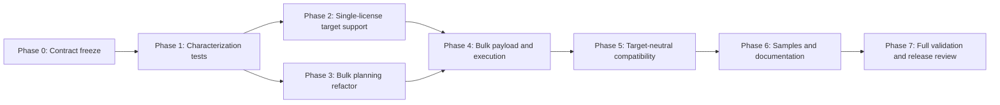

# Windows Server 2016 ESU Support Implementation Plan

Plan date: 2026-09-03

Status: Planning only. Do not execute this plan as part of the planning phase.

## Objective

Add Windows Server 2016 support to the repository's Azure Arc Extended Security Update (ESU) workflows while preserving Windows Server 2012 and Windows Server 2012 R2 compatibility, billing safeguards, authentication options, direct Azure Resource Manager (ARM) REST behavior, and English/French documentation parity.

The implementation must support both single-license creation and mixed-target bulk license creation. Existing assignment, unlink, status, and deletion operations are target-neutral and must be proven compatible through mocked contract tests rather than expanded with unnecessary target parameters.

## Source Of Truth

This plan implements the product contract established in [esu-windows-server-2016-research.md](esu-windows-server-2016-research.md). Revalidate the volatile Microsoft contracts in Phase 0 before changing code.

Primary Microsoft sources:

- [Prepare to deliver Extended Security Updates for Windows Server through Azure Arc](https://learn.microsoft.com/azure/azure-arc/servers/prepare-extended-security-updates)
- [Deliver Extended Security Updates for Windows Server through Azure Arc](https://learn.microsoft.com/azure/azure-arc/servers/deliver-extended-security-updates)
- [Programmatically deploy and manage Azure Arc ESU licenses](https://learn.microsoft.com/azure/azure-arc/servers/api-extended-security-updates)
- [License provisioning guidelines](https://learn.microsoft.com/azure/azure-arc/servers/license-extended-security-updates)
- [Billing service for ESUs enabled by Azure Arc](https://learn.microsoft.com/azure/azure-arc/servers/billing-extended-security-updates)
- [`Microsoft.HybridCompute/licenses@2026-06-16-preview` schema](https://learn.microsoft.com/azure/templates/microsoft.hybridcompute/2026-06-16-preview/licenses)
- [`Microsoft.HybridCompute/machines/licenseProfiles@2026-06-16-preview` schema](https://learn.microsoft.com/azure/templates/microsoft.hybridcompute/2026-06-16-preview/machines/licenseprofiles)

When repository documentation and scripts disagree, retain the scripts as the implementation baseline and record the documentation correction. Do not infer licensing behavior from existing code.

## Locked Product Decisions

1. `CreateESULicense.ps1` and `ManageESULicenses.ps1` receive an optional `-target` parameter.
2. `-target` defaults to `Windows Server 2012` for backward compatibility.
3. Accepted values are exactly:
   - `Windows Server 2012`
   - `Windows Server 2012 R2`
   - `Windows Server 2016`
4. The bulk CSV receives optional `Target`, `InvoiceId`, and `ProgramYear` columns.
5. A nonempty row `Target` overrides `-target`; an empty or absent value uses the parameter/default.
6. A nonempty row `InvoiceId` overrides an explicitly bound batch `-invoiceId`.
7. A nonempty row `ProgramYear` overrides an explicitly bound batch `-programYear`. When an effective invoice exists and no program year was explicitly supplied, use `Year 1`.
8. A program year without an effective invoice is invalid.
9. Windows Server 2016 rejects every effective `InvoiceId` and every explicitly supplied `ProgramYear`; Volume Licensing transition isn't supported for that target.
10. Mixed 2012, 2012 R2, and 2016 CSV files are supported.
11. Agent minimums are target-specific: 1.34 for 2012/R2 and 1.62 for 2016.
12. Any invalid row fails the complete bulk preflight before authentication or ARM mutation. Agent-version failures are no longer skipped.
13. `volumeLicenseDetails` is omitted from the JSON object when no valid 2012/R2 transition applies. It must never be emitted for 2016.
14. Reserved WS2012-specific ESU exception values are rejected for 2016. Arbitrary tags must not be represented as eligibility or billing controls.
15. Assignment, unlink, status, and deletion do not receive target-selection inputs unless Phase 0 finds a new official contract requiring them.
16. No new machine-read preflight or broader RBAC permission is introduced merely to compare the machine OS with the license target.

## Requirements

| ID | Requirement |
| --- | --- |
| REQ-001 | Preserve all existing public parameters, aliases, authentication paths, successful output behavior, and the default Windows Server 2012 target except where this plan explicitly changes behavior. |
| REQ-002 | Allow single-license creation for each of the three exact target values and emit the selected target in the ARM payload. |
| REQ-003 | Allow mixed-target bulk CSV processing with row-over-parameter target precedence. |
| REQ-004 | Resolve row and batch transition values deterministically and support Volume Licensing transition data only for 2012/R2. |
| REQ-005 | Complete all target, transition, exception, agent, naming, core, and assignment validation before authentication or mutation. |
| REQ-006 | Enforce agent 1.34 for 2012/R2 and 1.62 for 2016, failing the whole bulk input when any row is below its minimum. |
| REQ-007 | Build request bodies as PowerShell objects, omit inapplicable properties, and serialize with explicit `ConvertTo-Json` depth. |
| REQ-008 | Use endpoint-specific, currently documented API versions without silently coordinating unrelated resource types. |
| REQ-009 | Preserve `SupportsShouldProcess`, `-WhatIf`, `-Confirm`, and full read-only `-DryRun` behavior. |
| REQ-010 | Preserve core minimums, even-core normalization policy, edition/core-type restrictions, resource-group limits, cross-subscription IDs, and billing warnings. |
| REQ-011 | Prove assignment, unlink, status, and delete compatibility for Windows Server 2016 through mocked target-neutral contracts. |
| REQ-012 | Keep English and French help and documentation synchronized, including 2016 eligibility, prerequisites, billing dates, and unsupported benefits. |
| REQ-013 | Update the sample CSV and Azure Resource Graph examples so they produce exact target values and remain safe for mixed-target use. |
| REQ-014 | Mock authentication and every HTTP call in automated tests; never use a live Azure tenant as a validation target. |
| REQ-015 | Preserve least privilege and do not expand the custom role unless a separately approved requirement proves it necessary. |

## Scope

### In scope

- Target-aware single and bulk license creation/modification.
- Target-aware bulk validation and planning.
- Optional bulk transition columns and deterministic precedence.
- Windows Server 2016 agent and licensing restrictions.
- Endpoint-specific API-version constants for changed license operations.
- Mocked compatibility coverage for target-neutral operations.
- Sample, comment-based help, README, and English/French documentation changes.
- Azure Resource Graph query updates for exact target mapping.

### Out of scope

- SQL Server ESUs.
- Live Azure provisioning, assignment, activation, or deletion during testing.
- Automatic machine OS/license target comparison requiring additional ARM reads.
- New Azure Policy deployment or portal automation.
- Inventing a Windows Server 2016 licensing-package KB before Microsoft names one.
- Reusing WS2012 exception tags to claim a 2016 discount, DR benefit, dev/test benefit, or billing exemption.
- General refactoring, authentication redesign, module conversion, or API-version normalization unrelated to 2016 support.

## Technical Approach

### Endpoint ownership

Use separate constants for separate ARM contracts:

- License create/modify baseline: `Microsoft.HybridCompute/licenses@2026-06-16-preview`.
- License-profile link/unlink: retain each script's currently verified version unless Phase 0 establishes a required change.
- Status and delete: retain their target-neutral versions unless Phase 0 establishes a required change.

The implementation-day contract check may replace `2026-06-16-preview` only when a newer first-party public schema is available and explicitly contains all three targets. Do not select the separately observed `2026-07-15` version solely from provider metadata while its public Learn contract is unavailable.

### Bulk planning boundary

`ConvertTo-ESULicensePlan` is the controlling boundary. It must produce immutable plan items containing at least:

- `Target`
- `MinimumAgentVersion`
- `InvoiceId`
- `ProgramYears`
- `TransitionMode`
- Existing name, core, edition, assignment, server resource group, and exception data

The execution loop and request-body builder must consume these effective plan-item values. They must not read a global target or reapply batch defaults.

Capture whether `invoiceId` and `programYear` were explicitly bound from `$PSBoundParameters` before calling planning helpers. This prevents the declared backward-compatible `Year 1` default from being mistaken for transition intent.

### Transition resolution

For each row:

1. Resolve target from nonempty row value, then `-target`, then the 2012 default.
2. Resolve invoice from nonempty row value, then explicitly bound batch value, then no invoice.
3. Resolve program year from nonempty row value, then explicitly bound batch value, then `Year 1` only when an effective invoice exists.
4. Reject an explicit program year when no effective invoice exists.
5. Reject effective transition data for 2016.
6. Convert valid 2012/R2 `Year 1`, `Year 2`, or `Year 3` values into the existing preceding-year sequence.
7. Add `volumeLicenseDetails` only for a valid transition plan.

### Safety model

- Parameter and complete CSV validation occur before authentication.
- `-DryRun` may perform the existing read-only license count but sends no `PUT`, `PATCH`, or `DELETE`.
- `-WhatIf` authenticates as it does today but sends no mutation.
- Activated licenses can bill even while unassigned, so target and transition details must appear in preview and confirmation text.
- Post-EOS enrollment, reactivation, recreation, region changes, tenant changes, and added cores can trigger back-billing.
- Decrement, deactivation, or deletion can continue billing for up to five calendar days.

## Dependency Order



Do not begin a phase until the preceding phase's acceptance criteria and validation gate are satisfied. Phase 1 is an intentional-red TDD gate: existing characterization tests must be green, and the only permitted failures are the enumerated new tests for behavior assigned to Phases 2 through 4. Record those expected failures before proceeding. Phases 2 and 3 may then proceed in parallel only when they are kept in separate files/commits. Every phase after Phase 1 requires its affected tests to be green.

## Phase 0: Revalidate And Freeze The Microsoft Contract

### Goal

Confirm volatile API, licensing, and prerequisite facts before writing failing tests or implementation code.

### Tasks

- [ ] T001 [Plan:0.1] Recheck the programmatic ESU article and the versioned `Microsoft.HybridCompute/licenses` schema; record the selected license API version and its exact target enum in the implementation PR. [REQ-002, REQ-008]
- [ ] T002 [P] [Plan:0.2] Recheck the Windows Server 2016 preparation page for the agent minimum, supported editions, qualifying Software Assurance or equivalent Server Subscription coverage, the on-premises Software Assurance condition, SPLA restriction, portal availability, and any newly named licensing-package/SSU KB. [REQ-005, REQ-006, REQ-012]
- [ ] T003 [P] [Plan:0.3] Recheck billing guidance for the January 12, 2027 EOS date, January 13, 2027 billing start, back-billing, core additions, and five-day trailing charges. [REQ-010, REQ-012]
- [ ] T004 [P] [Plan:0.4] Recheck the delivery article for the exact reserved WS2012 exception values; freeze only explicitly documented values in tests and do not infer a broader prefix rule. [REQ-005, REQ-010]
- [ ] T005 [Plan:0.5] Confirm that license-profile assignment remains target-neutral and that no 2016 target/core-type field has appeared in `esuProfile`. [REQ-008, REQ-011]
- [ ] T006 [Plan:0.6] Compare required ARM actions with `Custom Roles/ARC ESU License Administrator.json`; document that no RBAC expansion is needed or stop for explicit approval if the contract proves otherwise. [REQ-015]

### Stop conditions

Stop implementation and update the research/plan before proceeding when any of these is true:

- No public first-party license schema supports `Windows Server 2016`.
- Microsoft changes the accepted target string or minimum agent version.
- The public schema and programmatic article conflict on a property required for the planned payload.
- Supporting the scenario requires a new ARM action or machine read not already approved.
- Windows Server 2016 transition or exception rules remain too ambiguous to validate without guessing.

### Acceptance criteria

- The implementation PR names the exact source URL and retrieval date for each volatile decision.
- License and license-profile versions are selected independently.
- No unresolved product assumption is converted into code.

## Phase 1: Add Characterization And Failing Contract Tests

### Goal

Freeze backward compatibility and create focused tests that fail for the missing Windows Server 2016 behavior before implementation.

### Tasks

- [ ] T007 [Plan:1.1] Create `tests/CreateESULicense.Tests.ps1` using mocked authentication and `Invoke-RestMethod`; characterize the existing 2012 default payload, URI, output, failure exit code, and `ShouldProcess` behavior. [REQ-001, REQ-007, REQ-009, REQ-014]
- [ ] T008 [Plan:1.2] Add failing single-license tests for all exact target values, invalid target rejection before authentication, and exact 2016 payload emission. [REQ-002, REQ-005, REQ-014]
- [ ] T009 [Plan:1.3] Extend `tests/ManageESULicenses.Tests.ps1` with failing pure-plan tests for row/parameter/default target precedence and mixed-target input. [REQ-003, REQ-005, REQ-014]
- [ ] T010 [Plan:1.4] Add failing transition-resolution tests covering row overrides, batch fallbacks, implicit `Year 1`, program year without invoice, property omission, and every 2016 transition rejection. [REQ-004, REQ-005, REQ-007]
- [ ] T011 [Plan:1.5] Add failing target-specific agent tests for 2012/R2 1.34 boundaries, 2016 1.62 boundaries, and whole-file rejection before authentication. [REQ-005, REQ-006]
- [ ] T012 [Plan:1.6] Characterize existing core normalization, edition restrictions, duplicate detection, assignment planning, resource-group limits, `DryRun`, `WhatIf`, and summary fields so target work cannot regress them. [REQ-001, REQ-009, REQ-010]
- [ ] T013 [Plan:1.7] Update `tests/ShouldProcess.Tests.ps1` only as needed to pass explicit target arguments through the new cases while preserving all existing no-mutation assertions. [REQ-009, REQ-014]

### Acceptance criteria

- Existing characterization tests pass before implementation.
- New Windows Server 2016 and mixed-target tests fail only for their expected missing behavior, with each failure mapped to a Phase 2, 3, or 4 task.
- Tests prove invalid bulk input reaches neither authentication nor any REST request.
- All test tokens, IDs, and secrets are clearly fictitious.

### Validation gate

Run only the touched suites first:

```powershell
Invoke-Pester -Path .\tests\CreateESULicense.Tests.ps1
Invoke-Pester -Path .\tests\ManageESULicenses.Tests.ps1
Invoke-Pester -Path .\tests\ShouldProcess.Tests.ps1
```

The first command is expected to include only the recorded focused red tests assigned to Phase 2. The second is expected to include only the recorded focused red tests assigned to Phases 3 and 4. Existing behavior tests must remain green, and any unplanned failure blocks implementation.

## Phase 2: Implement Single-License Target Support

### Goal

Make `CreateESULicense.ps1` create or modify a license for any supported target without changing existing callers.

### Tasks

- [ ] T014 [Plan:2.1] Add optional `-target` to `Scripts/windows/CreateESULicense.ps1` with the exact `ValidateSet` and default `Windows Server 2012`. Do not change existing names or aliases. [REQ-001, REQ-002]
- [ ] T015 [Plan:2.2] Replace the hardcoded target with the validated parameter in the PowerShell request object. [REQ-002, REQ-007]
- [ ] T016 [Plan:2.3] Introduce an explicit license API-version constant using the Phase 0 decision and assert the exact create/modify URI in tests. [REQ-008]
- [ ] T017 [Plan:2.4] Include the selected target in `ShouldProcess` action text and verbose payload output without exposing credentials. [REQ-002, REQ-009, REQ-010]
- [ ] T018 [Plan:2.5] Update comment-based help examples for default 2012, explicit 2012 R2, and explicit 2016 while preserving both authentication paths. [REQ-001, REQ-012]
- [ ] T019 [Plan:2.6] Make the new single-license contract tests green, including invalid target rejection before authentication and no REST request under `WhatIf`. [REQ-002, REQ-005, REQ-009, REQ-014]
- [ ] T020 [Plan:2.7] Run the PowerShell parser and PSScriptAnalyzer against `Scripts/windows/CreateESULicense.ps1`; fix only findings introduced by this phase. [REQ-001]

### Acceptance criteria

- Omitting `-target` produces the same 2012 target as before.
- Each exact target emits exactly one matching `licenseDetails.target` value.
- Invalid target input is rejected by parameter binding before authentication.
- Request JSON remains object-built and uses an explicit serialization depth.
- `WhatIf` and declined confirmation send no mutation.

## Phase 3: Refactor Bulk Resolution Into Complete Preflight Planning

### Goal

Resolve every target-dependent decision before authentication and expose it in a validated plan item.

### Tasks

- [ ] T021 [Plan:3.1] Add optional batch `-target` to `Scripts/windows/ManageESULicenses.ps1` with the exact `ValidateSet` and 2012 default. [REQ-001, REQ-003]
- [ ] T022 [Plan:3.2] Treat `Target`, `InvoiceId`, and `ProgramYear` as optional CSV columns while retaining all current required columns and accepting legacy CSV files unchanged. [REQ-001, REQ-003, REQ-004]
- [ ] T023 [Plan:3.3] Capture `PSBoundParameters.ContainsKey('invoiceId')` and `PSBoundParameters.ContainsKey('programYear')` before invoking planning helpers. [REQ-004]
- [ ] T024 [Plan:3.4] Add a pure target-resolution helper or equivalent local logic that applies row-over-parameter-default precedence and stores the effective target on every plan item. [REQ-003, REQ-005]
- [ ] T025 [Plan:3.5] Add a pure transition-resolution helper or equivalent local logic implementing the exact invoice/program-year precedence and implicit `Year 1` rule. [REQ-004, REQ-005]
- [ ] T026 [Plan:3.6] Store effective `InvoiceId`, `ProgramYears`, and `TransitionMode` on each plan item; use null/empty transition data when no transition applies. [REQ-004, REQ-007]
- [ ] T027 [Plan:3.7] Reject any 2016 effective invoice or explicitly supplied program year with an actionable row/column error. [REQ-004, REQ-005]
- [ ] T028 [Plan:3.8] Replace `SkipAgentVersion` planning with target-specific preflight errors at 1.34 and 1.62 boundaries; aggregate these with all other row errors. [REQ-005, REQ-006]
- [ ] T029 [Plan:3.9] Reject only the Phase 0 confirmed WS2012-specific exception values for 2016 and explain that tags don't establish eligibility or alter billing. [REQ-005, REQ-010]
- [ ] T030 [Plan:3.10] Add `Target`, transition mode, and minimum-agent information to `DryRun`/validated-plan output; retain existing summary field names where practical, with no valid execution reporting an agent-version skip. [REQ-001, REQ-006, REQ-009]
- [ ] T031 [Plan:3.11] Make all pure planning tests green and prove a file containing one invalid row performs no authentication and no REST operation for any row. [REQ-005, REQ-006, REQ-014]

### Acceptance criteria

- Legacy CSV input without new columns still resolves to 2012 and no transition unless batch transition values were explicitly supplied.
- Mixed-target input is valid when each row's licensing inputs are compatible.
- All target, transition, exception, and agent errors identify row and column.
- No global target or batch transition value is consulted during execution.
- The whole CSV is accepted or rejected as one preflight unit.

## Phase 4: Build Target-Aware Bulk Payloads And Execute The Plan

### Goal

Use only effective plan-item values to create licenses and preserve target-neutral assignment behavior.

### Tasks

- [ ] T032 [Plan:4.1] Replace `$global:targetOS` in `Scripts/windows/ManageESULicenses.ps1` with an endpoint-specific license API-version constant and per-plan-item target data. [REQ-003, REQ-008]
- [ ] T033 [Plan:4.2] Change the internal `CreateESULicense` function to accept effective target and transition data explicitly. [REQ-003, REQ-004, REQ-007]
- [ ] T034 [Plan:4.3] Build `licenseDetails` as a PowerShell object and conditionally add `volumeLicenseDetails` only for valid 2012/R2 transition plans. [REQ-004, REQ-007]
- [ ] T035 [Plan:4.4] Ensure 2016 payloads contain no empty, null, or populated `volumeLicenseDetails` property. [REQ-004, REQ-007]
- [ ] T036 [Plan:4.5] Keep assignment/unlink payloads unchanged and keep assigned license resource IDs explicit about the applicable subscription. [REQ-010, REQ-011, REQ-015]
- [ ] T037 [Plan:4.6] Include target and transition mode in per-row `ShouldProcess` text and final preview without changing secrets or authorization-header handling. [REQ-009, REQ-010]
- [ ] T038 [Plan:4.7] Assert exact endpoint-specific URIs and deep JSON payloads for 2012, 2012 R2, 2016, mixed files, and transition/no-transition cases. [REQ-002, REQ-003, REQ-004, REQ-008]
- [ ] T039 [Plan:4.8] Make bulk process tests green for `DryRun`, `WhatIf`, successful mocked execution, and aggregated failure exits. [REQ-005, REQ-009, REQ-014]

### Acceptance criteria

- Every emitted license payload uses the row's effective target.
- Transition arrays preserve preceding-year behavior for applicable 2012/R2 rows.
- Inapplicable properties are absent, not empty placeholders.
- `DryRun` performs only documented read-only requests.
- `WhatIf` and declined confirmations perform no mutation.
- Existing edition, core, resource-limit, naming, and assignment safeguards remain green.

## Phase 5: Prove Target-Neutral Lifecycle Compatibility

### Goal

Verify that existing link, unlink, status, and delete contracts work with Windows Server 2016 license resource IDs without adding unnecessary target inputs.

### Tasks

- [ ] T040 [P] [Plan:5.1] Extend `tests/ManageESUAssignments.Tests.ps1` with 2016-named license IDs for assign/unlink and assert bodies remain generation-neutral in both English and French scripts. [REQ-011, REQ-014]
- [ ] T041 [P] [Plan:5.2] Extend `tests/CheckESUStatus.Tests.ps1` with 2016 assignment-state responses and assert existing output objects remain unchanged. [REQ-001, REQ-011, REQ-014]
- [ ] T042 [P] [Plan:5.3] Add or extend mocked coverage for `Scripts/windows/AssignESULicense.ps1` and `Scripts/windows/DeleteESULicense.ps1`, proving exact target-neutral URIs and no target parameter requirement. [REQ-001, REQ-008, REQ-011]
- [ ] T043 [Plan:5.4] Re-run cross-subscription tests and assert license IDs retain the license subscription while machine profile requests retain the machine subscription. [REQ-010, REQ-015]
- [ ] T044 [Plan:5.5] Verify no runtime change is needed in `Scripts/windows/ManageESUAssignments.ps1`, `Scripts/windows/ManageESUAssignmentsFR.ps1`, or `Scripts/windows/CheckESUStatus.ps1`; avoid code-only churn when tests already prove compatibility. [REQ-001, REQ-011]
- [ ] T045 [Plan:5.6] Verify `Custom Roles/ARC ESU License Administrator.json` remains least privilege and unchanged unless Phase 0 produced an approved exception. [REQ-015]

### Acceptance criteria

- Assignment and unlink bodies contain only location and `esuProfile.assignedLicense`/empty `esuProfile` as appropriate.
- Status output compatibility is preserved.
- Delete behavior remains target-neutral and retains billing warnings and `ShouldProcess`.
- No machine-read permission or cross-tenant behavior is introduced.

## Phase 6: Update Samples, Help, And Customer Documentation

### Goal

Make Windows Server 2016 support discoverable and safe for both English and French users.

### Tasks

- [ ] T046 [Plan:6.1] Update `samples/ManageESULicenses.csv` with `Target`, `InvoiceId`, and `ProgramYear` columns plus fictitious 2012/R2 transition and 2016 non-transition examples. [REQ-003, REQ-004, REQ-013]
- [ ] T047 [Plan:6.2] Update comment-based help in `Scripts/windows/CreateESULicense.ps1` and `Scripts/windows/ManageESULicenses.ps1` for target values, precedence, mixed files, agent versions, transition restrictions, and safe preview behavior. [REQ-012]
- [ ] T048 [Plan:6.3] Update `README.md` and `LISEZMOI.md` so the repository purpose, prerequisites, script matrix, examples, billing dates, and Azure Resource Graph queries cover 2012/R2 and 2016. [REQ-012, REQ-013]
- [ ] T049 [Plan:6.4] Change Azure Resource Graph examples to include 2012, 2012 R2, and 2016 and emit an exact `Target` value suitable for the CSV contract; retain guidance to review null/incorrect core counts manually. [REQ-005, REQ-013]
- [ ] T050 [P] [Plan:6.5] Update `docs/English/windows/CreateESULicense.md` and `docs/Français/windows/CreateESULicense.md` with synchronized target parameters and examples. [REQ-002, REQ-012]
- [ ] T051 [P] [Plan:6.6] Update `docs/English/windows/ManageESULicenses.md` and `docs/Français/windows/ManageESULicenses.md` with synchronized columns, precedence, mixed-target examples, and failure behavior. [REQ-003, REQ-004, REQ-006, REQ-012]
- [ ] T052 [P] [Plan:6.7] Update English/French assignment, status, and deletion guides to state 2016 compatibility without adding target inputs or promising local OS/target validation. [REQ-011, REQ-012, REQ-015]
- [ ] T053 [Plan:6.8] Document 2016 Standard/Datacenter eligibility, agent 1.62, qualifying Software Assurance or equivalent Server Subscription coverage, the on-premises Software Assurance condition, no SPLA, no Volume Licensing transition, no documented Visual Studio dev/test benefit, no WS2012 exception-tag reuse, and unavailability in Azure operated by 21Vianet. [REQ-005, REQ-006, REQ-010, REQ-012]
- [ ] T054 [Plan:6.9] Document January 12, 2027 EOS, January 13, 2027 billing start, activated-unassigned billing, core-addition billing, five-day trailing charges, and back-billing after late enrollment, reactivation, recreation, region changes, or tenant changes. [REQ-010, REQ-012]
- [ ] T055 [Plan:6.10] Link 2016 licensing-package/SSU guidance to the current Microsoft page unless Phase 0 identified an explicit 2016 KB; never substitute the 2012 KB. [REQ-005, REQ-012]

### Acceptance criteria

- English and French counterparts describe the same behavior and restrictions.
- Legacy and language-specific bulk guides do not disagree.
- Every sample CSV imports successfully and every example uses fictitious data.
- No documentation describes a tag as a billing control.
- Customer eligibility guidance states the qualifying Software Assurance or equivalent Server Subscription requirement and the on-premises Software Assurance condition.
- Customer prerequisites identify the Azure operated by 21Vianet limitation and all currently documented back-billing triggers.
- No documentation claims that the scripts locally prove machine OS/target compatibility.

## Phase 7: Full Validation, Independent Review, And Release Readiness

### Goal

Prove the complete change is syntactically valid, behaviorally covered, secret-free, documentation-complete, and limited to the approved contract.

### Tasks

- [ ] T056 [Plan:7.1] Parse every changed `.ps1` file with `System.Management.Automation.Language.Parser` and fail on any parse error. [REQ-014]
- [ ] T057 [Plan:7.2] Run `Invoke-ScriptAnalyzer` on every changed PowerShell file when PSScriptAnalyzer is installed; report unavailability rather than installing it implicitly. [REQ-014]
- [ ] T058 [Plan:7.3] Run focused Pester suites after each phase, then run `Invoke-Pester -Path .\tests -PassThru` and require zero failures. [REQ-014]
- [ ] T059 [Plan:7.4] Run sample CSV import checks, including legacy-column and new mixed-target files. [REQ-001, REQ-003, REQ-013]
- [ ] T060 [Plan:7.5] Check all local Markdown links and the final diff for whitespace errors. [REQ-012]
- [ ] T061 [Plan:7.6] Scan added lines for bearer tokens, client secrets, authorization headers, tenant/subscription identifiers that aren't obvious placeholders, and customer data. [REQ-014]
- [ ] T062 [Plan:7.7] Review the final diff for accidental public-interface changes, stale API-version assertions, missing French updates, and unrelated formatting churn. [REQ-001, REQ-008, REQ-012]
- [ ] T063 [Plan:7.8] Obtain an independent code review focused on billing behavior, transition omission, mixed-target precedence, pre-authentication failure, and target-neutral compatibility. [REQ-004, REQ-005, REQ-010, REQ-011]
- [ ] T064 [Plan:7.9] Add release notes that call out Windows Server 2016 support, new CSV columns, API contract date, and the intentional change from agent-version skipping to whole-file preflight failure. [REQ-001, REQ-006, REQ-012]
- [ ] T065 [Plan:7.10] Confirm `.github/workflows/quality.yml` discovers the new tests and sample checks; modify it only if existing discovery doesn't cover them. [REQ-013, REQ-014]

### Final validation commands

```powershell
$parseErrors = @()
Get-ChildItem -Path . -Filter *.ps1 -Recurse -File | ForEach-Object {
    $tokens = $null
    $fileErrors = $null
    [System.Management.Automation.Language.Parser]::ParseFile(
        $_.FullName,
        [ref]$tokens,
        [ref]$fileErrors
    ) | Out-Null
    $parseErrors += $fileErrors
}
if ($parseErrors.Count -gt 0) {
    $parseErrors
    exit 1
}
```

```powershell
if (Get-Command Invoke-ScriptAnalyzer -ErrorAction SilentlyContinue) {
    Invoke-ScriptAnalyzer -Path .\Scripts\windows\CreateESULicense.ps1
    Invoke-ScriptAnalyzer -Path .\Scripts\windows\ManageESULicenses.ps1
} else {
    Write-Warning 'PSScriptAnalyzer is not installed; analyzer validation was not run.'
}
```

```powershell
$result = Invoke-Pester -Path .\tests -PassThru
if ($result.FailedCount -ne 0) {
    throw "Pester failed: $($result.FailedCount) test(s)."
}
```

```powershell
git -c core.whitespace=cr-at-eol diff --check
if ($LASTEXITCODE -ne 0) {
    throw 'Diff whitespace check failed.'
}
```

Do not run any script against a live Azure tenant as part of these gates.

### Final acceptance criteria

- Windows Server 2012 remains the default for existing command lines and legacy CSV files.
- Single and mixed-target bulk creation emit the exact intended target.
- Invalid target-dependent input fails before authentication and before all REST calls.
- Windows Server 2016 never emits Volume Licensing transition details.
- Agent thresholds are target-aware and fail the entire invalid bulk plan.
- `DryRun`, `WhatIf`, and confirmation behavior remain non-mutating.
- Target-neutral lifecycle operations are proven compatible through mocks.
- English/French docs and samples are synchronized and billing-safe.
- Full Pester, parser, analyzer (when available), link, CSV, whitespace, and secret checks pass.

## Proposed Change Sets

Keep review units small and dependency-ordered:

1. Contract notes and failing/characterization tests.
2. Single-license target support and tests.
3. Bulk preflight planning and pure tests.
4. Bulk payload/execution changes and mocked process tests.
5. Target-neutral compatibility tests.
6. Samples, help, and synchronized English/French documentation.
7. Final validation fixes and release notes.

Do not combine unrelated refactors with these change sets.

## Requirement Mapping

| Requirement | Plan items | Expected implementation evidence |
| --- | --- | --- |
| REQ-001 | 1.1, 1.6, 2.1, 3.1, 3.2, 3.10, 5.2, 5.3, 5.4, 7.4, 7.7, 7.9 | Existing command lines/tests remain green; default target tests; unchanged output contracts. |
| REQ-002 | 0.1, 1.2, 2.1-2.6, 4.7, 6.5 | `Scripts/windows/CreateESULicense.ps1`; `tests/CreateESULicense.Tests.ps1`; creation guides. |
| REQ-003 | 1.3, 3.1, 3.2, 3.4, 3.6, 4.1, 4.2, 4.7, 6.1, 6.6, 7.4 | `Scripts/windows/ManageESULicenses.ps1`; mixed-target Pester cases; sample CSV. |
| REQ-004 | 1.4, 3.2, 3.3, 3.5-3.7, 4.2-4.4, 4.7, 6.1, 6.6, 7.8 | Transition resolver tests and conditional request-body assertions. |
| REQ-005 | 0.2, 0.4, 1.2-1.5, 3.4, 3.5, 3.7-3.9, 3.11, 4.8, 6.4, 6.8, 6.10, 7.8 | Pre-authentication validation tests; row/column errors; updated guidance. |
| REQ-006 | 0.2, 1.5, 3.8, 3.10, 3.11, 6.6, 6.8, 7.9 | Agent boundary tests and removal of skip execution behavior. |
| REQ-007 | 1.1, 1.4, 2.2, 2.4, 3.6, 4.2-4.4 | PowerShell object payload builders and deep JSON tests. |
| REQ-008 | 0.1, 0.5, 2.3, 4.1, 4.7, 5.3, 7.7 | Endpoint constants and exact mocked URI assertions. |
| REQ-009 | 1.1, 1.6, 1.7, 2.4, 2.6, 3.10, 4.6, 4.8 | `ShouldProcess` and process-safety Pester coverage. |
| REQ-010 | 0.3, 0.4, 1.6, 2.4, 3.9, 4.5, 4.6, 5.4, 6.8, 6.9, 7.8 | Existing safety tests, billing text, explicit cross-subscription IDs. |
| REQ-011 | 0.5, 4.5, 5.1-5.4, 6.7, 7.8 | Assignment/status/delete mocked contracts with 2016 license IDs. |
| REQ-012 | 0.2, 0.3, 2.5, 6.2-6.10, 7.5, 7.7, 7.9 | Comment help, README/LISEZMOI, and paired English/French guides. |
| REQ-013 | 6.1, 6.3, 6.4, 7.4, 7.10 | Updated sample CSV, exact-target Resource Graph output, workflow discovery. |
| REQ-014 | 1.1, 1.2, 1.6, 5.1-5.3, 7.1-7.3, 7.6, 7.10 | Mock-only Pester suite, parser/analyzer output, secret scan. |
| REQ-015 | 0.6, 4.5, 5.4, 5.6, 6.7 | Unchanged least-privilege role and no new machine-read behavior. |

## Residual Risks

- Microsoft documentation can change before the implementation starts; Phase 0 is mandatory.
- The public programmatic article may continue to show an older API version than the versioned schema that exposes the 2016 target. The implementation must document the endpoint-specific choice and test the exact URI.
- Microsoft hasn't named a Windows Server 2016 licensing-package/SSU KB in the current Arc preparation guidance. Documentation must link to the current guidance rather than guess.
- Azure remains the final authority on machine OS/license target compatibility because this plan deliberately avoids broader machine-read permissions.
- Mixed-target batch transition defaults are easy to misuse. Documentation must recommend row-level transition fields when a file contains 2016 rows.
- Activated but unassigned licenses can incur charges. Preview and confirmation output must make target, state, edition, core type, core count, and transition mode visible before mutation.