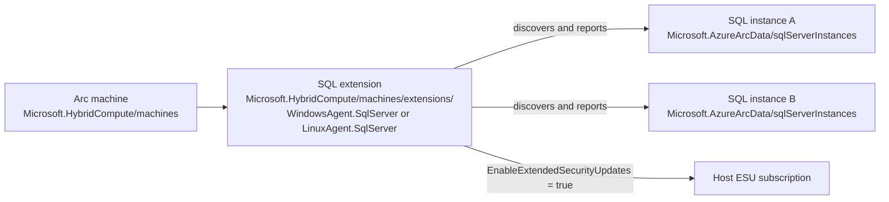

# SQL Server ESU resource ownership in Azure Arc

Research validation date: 2026-09-04

## Purpose

This note explains why SQL Server Extended Security Update (ESU) automation for Azure Arc must update the Azure Extension for SQL Server instead of an individual `Microsoft.AzureArcData/sqlServerInstances` resource.

The distinction matters because Azure represents the Arc machine, its shared SQL configuration, and each discovered SQL Server instance as separate resources.

## Resource model



### Arc machine

`Microsoft.HybridCompute/machines` represents the physical server or virtual machine connected to Azure Arc. It provides the host identity and machine-level state, but it does not contain the SQL ESU subscription setting.

### Discovered SQL Server instances

Azure creates a `Microsoft.AzureArcData/sqlServerInstances` resource for each discovered SQL Server instance or supported SQL component. The current resource schema includes properties such as:

- Instance name
- SQL Server version
- Edition
- Service type
- Host type
- Operating system environment core count
- Supported instance-level configuration, including monitoring, backup policy, migration assessment, and Microsoft Entra authentication

Microsoft's published Azure Resource Graph examples associate each instance with its Arc machine through `properties.containerResourceId`.

The current `sqlServerInstances` schema does not define `EnableExtendedSecurityUpdates`, `enableExtendedSecurityUpdates`, or another host ESU enrollment property. Patching that resource to add such a property is therefore not a documented or supported way to subscribe the host to ESUs.

Describing `sqlServerInstances` as only an "inventory and status resource" is shorthand and is not fully precise because the resource supports some writable instance-level features. The accurate boundary is:

> `Microsoft.AzureArcData/sqlServerInstances` provides discovered inventory and supported instance-level configuration, but it does not own the host-level ESU subscription setting.

### Azure Extension for SQL Server

The Azure Extension for SQL Server is a child of the Arc machine:

```text
Microsoft.HybridCompute/machines/<machine-name>/extensions/WindowsAgent.SqlServer
```

On Linux, the extension is normally named `LinuxAgent.SqlServer`. Both extension types use publisher `Microsoft.AzureData`.

Microsoft documents the SQL Server configuration as a set of properties that apply to all SQL Server instances installed on an Arc-enabled server. Selecting **Subscribe to Extended Security Updates** sets the host configuration property `EnableExtendedSecurityUpdates` to `True`.

The documented PowerShell settings use the following representation:

```powershell
$Settings = @{
    SqlManagement = @{ IsEnabled = $true }
    LicenseType = 'PAYG'
    enableExtendedSecurityUpdates = $true
    esuLastUpdatedTimestamp = [DateTime]::UtcNow.ToString('yyyy-MM-ddTHH:mm:ss.fffZ')
}
```

`PAYG` is illustrative. Automation must preserve the current license type unless the customer explicitly requests and confirms a change. An ESU subscription requires an eligible `PAYG` or `Paid` license type; it must not be inferred from SQL edition.

The Azure CLI reinforces this ownership boundary:

```azurecli
az sql server-arc extension set \
  --resource-group MyResourceGroup \
  --machine-name MyArcServerName \
  --esu-enabled True
```

Microsoft describes this command as updating "common host properties." The related `extension show` command displays "host properties." Although that command can accept a SQL Arc instance resource name as a lookup input, the setting it resolves and changes remains host-level extension configuration.

## Concrete example

Assume the Arc machine `SQLHOST01` contains:

- Default instance `MSSQLSERVER`, running SQL Server 2014 Enterprise
- Named instance `REPORTING`, running SQL Server 2016 Standard

Azure can expose two `Microsoft.AzureArcData/sqlServerInstances` resources, one for each discovered instance, but the machine has one `WindowsAgent.SqlServer` extension.

Enabling ESUs changes the shared extension setting:

```text
SQLHOST01/extensions/WindowsAgent.SqlServer
    enableExtendedSecurityUpdates = true
```

The automation must not model this as two independent instance mutations:

```text
MSSQLSERVER.ESU = true
REPORTING.ESU = true
```

The host setting applies to eligible SQL Server instances in that operating system environment. Azure evaluates eligibility and metering for the discovered versions and editions according to the SQL Server ESU rules.

## Automation consequences

The proposed automation should use each resource for its documented purpose:

1. Read `Microsoft.AzureArcData/sqlServerInstances` resources to inventory installed versions, editions, instance names, service types, and other eligibility evidence.
2. Read `Microsoft.HybridCompute/machines` to verify the Arc host identity and connection state.
3. Read the `WindowsAgent.SqlServer` or `LinuxAgent.SqlServer` extension to inspect license type, ESU configuration, extension health, and existing settings.
4. Preserve all existing public extension settings and change only the explicitly requested ESU fields. Microsoft's generic extension update command can overwrite the complete settings object.
5. Update the `Microsoft.HybridCompute/machines/extensions` resource, not an individual `sqlServerInstances` resource.
6. Read the extension again after the operation and verify the effective host setting and extension health.
7. Correlate the discovered instances back to the host to report which installations appear eligible and affected.

Microsoft's own Resource Graph example follows this pattern. It selects version and edition from `Microsoft.AzureArcData/sqlServerInstances`, joins those resources to their Arc machines, and then joins the SQL extension to obtain `LicenseType` and `enableExtendedSecurityUpdates`.

## Separate physical-core license resource

The unlimited virtualization path introduces another resource, `Microsoft.AzureArcData/sqlServerEsuLicenses`. That resource represents a physical-core ESU license and its scope, billing plan, core count, version, and activation state.

It does not replace the host extension setting. Each intended VM must still subscribe to ESUs and be configured to use the physical-core ESU license. Physical-core assignment remains a separate implementation track because current Microsoft documentation has used inconsistent extension property names for that intent.

## Official Microsoft references

- [Configure SQL Server enabled by Azure Arc](https://learn.microsoft.com/sql/sql-server/azure-arc/manage-configuration?view=sql-server-ver17)
- [SQL Server enabled by Azure Arc overview](https://learn.microsoft.com/sql/sql-server/azure-arc/overview?view=sql-server-ver17)
- [Microsoft.AzureArcData/sqlServerInstances 2026-01-01 resource schema](https://learn.microsoft.com/azure/templates/microsoft.azurearcdata/2026-01-01/sqlserverinstances)
- [Azure CLI SQL Server Arc extension commands](https://learn.microsoft.com/cli/azure/sql/server-arc/extension?view=azure-cli-latest)
- [SQL Server Extended Security Updates enabled by Azure Arc](https://learn.microsoft.com/sql/sql-server/azure-arc/extended-security-updates?view=sql-server-ver17)

This note supplements the broader research and implementation plan in [SQL Server ESUs through Azure Arc: research and implementation plan](esu-sql-server-arc-research.md).