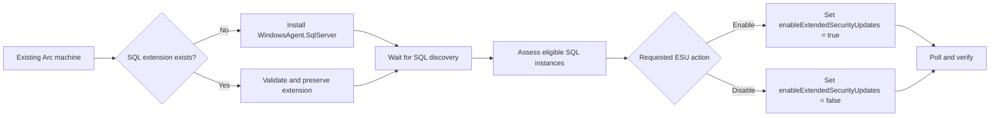
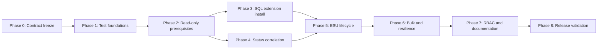

# SQL Server Arc Extension and ESU Enablement Implementation Plan

Plan date: 2026-09-04

Status: Planning only. This plan does not authorize any Azure mutation.

## Objective

Add PowerShell 7 automation that installs the Azure Extension for SQL Server on existing Azure Arc-enabled Windows machines and manages per-host SQL Server Extended Security Update (ESU) subscriptions through Azure Arc.

The implementation must support single-machine and bulk CSV workflows, direct Azure Resource Manager (ARM) REST calls, service-principal and user-token authentication, read-only prerequisite and status reporting, ESU enablement and cancellation, complete preflight validation, standard PowerShell confirmation controls, and English/French documentation parity.

Installing or onboarding the Azure Connected Machine agent is explicitly outside this work. Every target must already exist as `Microsoft.HybridCompute/machines` before any SQL extension or ESU operation begins.

## Source of Truth

This plan implements the product boundaries established in:

- [SQL Server ESUs through Azure Arc: research and implementation plan](esu-sql-server-arc-research.md)
- [SQL Server ESU resource ownership in Azure Arc](sql-server-arc-esu-resource-model.md)

Revalidate the volatile Microsoft contracts in Phase 0 before implementing code. The controlling first-party sources are:

- [Prerequisites for SQL Server enabled by Azure Arc](https://learn.microsoft.com/sql/sql-server/azure-arc/prerequisites?view=sql-server-ver17)
- [Connect SQL Server on a server already enabled by Azure Arc](https://learn.microsoft.com/sql/sql-server/azure-arc/connect-already-enabled?view=sql-server-ver17)
- [Configure SQL Server enabled by Azure Arc](https://learn.microsoft.com/sql/sql-server/azure-arc/manage-configuration?view=sql-server-ver17)
- [SQL Server Extended Security Updates enabled by Azure Arc](https://learn.microsoft.com/sql/sql-server/azure-arc/extended-security-updates?view=sql-server-ver17)
- [SQL Server ESU FAQ](https://learn.microsoft.com/sql/sql-server/end-of-support/extended-security-updates-frequently-asked-questions?view=sql-server-ver17)
- [Azure Extension for SQL Server release notes](https://learn.microsoft.com/sql/sql-server/azure-arc/release-notes?view=sql-server-ver17)
- [Virtual machine extension management with Azure Arc-enabled servers](https://learn.microsoft.com/azure/azure-arc/servers/manage-vm-extensions)
- [Hybrid Compute machine-extension REST API](https://learn.microsoft.com/rest/api/hybridcompute/machine-extensions)
- [Microsoft.AzureArcData/sqlServerInstances resource schema](https://learn.microsoft.com/azure/templates/microsoft.azurearcdata/2026-01-01/sqlserverinstances)

When repository documentation and scripts disagree, use the scripts as the repository implementation baseline and record the documentation correction. Do not infer licensing, eligibility, or billing behavior from existing Windows Server ESU code.

## Locked Product Decisions

1. The first release targets Windows machines in commercial Azure only.
2. Every target machine must already be connected to Azure Arc in full mode. Connected Machine agent installation, onboarding, repair, and upgrade are out of scope.
3. The automation installs `WindowsAgent.SqlServer` only when the SQL extension is absent.
4. If `WindowsAgent.SqlServer` already exists, installation reports `AlreadyInstalled` and sends no mutation request.
5. Existing extension settings, handler version, and automatic-upgrade flags are not changed by the installation workflow.
6. Newly installed extensions have automatic extension upgrades enabled so they remain within Microsoft's supported release window.
7. Existing extensions outside Microsoft's supported release window fail ESU readiness checks. This release does not force an extension upgrade.
8. ESU configuration is host-scoped and is written to `Microsoft.HybridCompute/machines/extensions`, not to `Microsoft.AzureArcData/sqlServerInstances`.
9. ESU enablement and cancellation require an existing, healthy, supported SQL extension. The ESU script does not install the extension as a side effect.
10. `LicenseType` is preserved by default. A caller may explicitly change it to `Paid` or `PAYG` during ESU enablement only after acknowledging that change.
11. ESU enablement fails when the effective license type is `LicenseOnly`.
12. ESU cancellation does not change `LicenseType`.
13. Both physical servers running SQL directly and individually Arc-enabled SQL virtual machines are supported by per-host subscription metering.
14. Caller-supplied core counts are not accepted. Azure Extension for SQL Server detects the host type and billable cores.
15. Physical-core pooled ESU licenses and unlimited virtualization through `Microsoft.AzureArcData/sqlServerEsuLicenses` are excluded from the first release.
16. Automatic SQL/Windows patch configuration is excluded. ESU enrollment establishes entitlement; it must not silently enable automatic updates.
17. The direct ARM REST approach remains the runtime implementation. Azure CLI and Az PowerShell examples are documentation references, not runtime dependencies.
18. Both existing authentication paths remain available: service-principal credentials and a caller-provided `Get-AzAccessToken` token object.
19. All automated tests mock authentication and HTTP requests. No live Azure tenant is an automated validation target.
20. Each public script is fully standalone and does not require a shared helper script at runtime.
21. Extension installation and ESU enablement require `-ConfirmExternalPrerequisites` in single-machine mode or `ConfirmExternalPrerequisites=TRUE` for each applicable CSV row.
22. Missing or older-than-24-hour SQL inventory and usage timestamps produce prominent warnings and uncertain eligibility status, but do not independently block ESU enablement when all other requirements and acknowledgements pass.
23. Bulk execution continues after individual runtime failures, records each result, and makes reruns idempotent by skipping rows already in the requested state.

## Requirements

| ID | Requirement |
| --- | --- |
| REQ-001 | Operate only on existing commercial-Azure `Microsoft.HybridCompute/machines` resources and never install, onboard, repair, or upgrade the Connected Machine agent. |
| REQ-002 | Install `WindowsAgent.SqlServer` with publisher `Microsoft.AzureData`, SQL management enabled, an explicit valid license type, and automatic extension upgrades enabled when the extension is absent. |
| REQ-003 | Treat an existing valid SQL extension as idempotent success without changing its settings, version, or upgrade flags; fail on a conflicting publisher/type. |
| REQ-004 | Provide read-only prerequisite assessment for one machine or a CSV set before extension installation or ESU mutation. |
| REQ-005 | Enable and disable the host-level SQL ESU subscription by changing only documented extension settings and refreshing the ESU timestamp. |
| REQ-006 | Preserve all unrelated public extension settings through a read-copy-modify-write operation and omit response-only fields from request bodies. |
| REQ-007 | Preserve `LicenseType` by default; permit an explicitly acknowledged change to `Paid` or `PAYG` during enablement; reject effective `LicenseOnly` enablement. |
| REQ-008 | Validate current SQL Server 2014/2016 eligibility and report version, edition, environment, host type, detected cores, mixed-version metering, inventory freshness, and unsupported or uncertain state; stale timestamps warn but do not independently block enablement. |
| REQ-009 | Require explicit acknowledgement of current-year back-billing risk for every enable or re-enable operation and explain cancellation/reconnection consequences. |
| REQ-010 | Support physical servers running SQL directly and individual Arc-enabled SQL VMs without asking for core counts or claiming pooled physical-core coverage. |
| REQ-011 | Provide single-machine and complete-preflight bulk CSV workflows for extension installation and ESU enable/disable. |
| REQ-012 | Provide a read-only status workflow for one machine or CSV input that correlates machine, extension, and discovered SQL instance resources. |
| REQ-013 | Preserve service-principal and user-token authentication without printing, logging, or persisting credentials or authorization headers. |
| REQ-014 | Use endpoint-specific current API versions, explicit subscription-aware resource IDs, paginated list handling, bounded retries, asynchronous operation polling, and post-operation verification. |
| REQ-015 | Build JSON bodies as PowerShell objects and serialize them with an explicit depth; do not hand-build JSON strings. |
| REQ-016 | Implement `SupportsShouldProcess`, `-WhatIf`, `-Confirm`, and `-DryRun`; no mutation may occur when previewed or declined. |
| REQ-017 | Aggregate validation errors before authentication, continue independent bulk rows after runtime failures, use nonzero exits for validation/authentication/REST/verification failures, and provide deterministic summaries suitable for idempotent reruns. |
| REQ-018 | Create and validate SQL-specific least-privilege read-only and operator RBAC definitions without provider-registration or Connected Machine deletion privileges. |
| REQ-019 | Keep English and French help, guides, samples, and root navigation synchronized and use only fictitious identifiers and secrets. |
| REQ-020 | Keep physical-core pooled licensing, Azure Government, Linux, Connected Machine onboarding, automatic patching, and live automated tests out of scope. |
| REQ-021 | Report local SQL permissions and network prerequisites that cannot be proven through ARM; do not silently grant SQL permissions or change firewalls. |

## Scope

### In scope

- Read-only assessment of already Arc-connected Windows machines.
- Single-machine and bulk installation of a missing Azure Extension for SQL Server.
- Detection and idempotent handling of an existing SQL extension.
- SQL Server discovery/status correlation after extension installation.
- Per-host SQL Server 2014 and SQL Server 2016 ESU enablement and cancellation.
- Physical servers running SQL Server directly.
- Individually Arc-enabled SQL Server VMs on a physical virtualization host.
- Optional, explicit `Paid` or `PAYG` license-type change during ESU enablement.
- Billing acknowledgement, preview, confirmation, retry, polling, and verification safeguards.
- SQL-specific least-privilege custom roles.
- Mocked Pester tests, sample CSVs, comment-based help, and English/French documentation.

### Out of scope

- Installing, onboarding, reconnecting, repairing, or upgrading the Azure Connected Machine agent.
- Creating or deleting `Microsoft.HybridCompute/machines` resources.
- Operating on machines not already connected in full mode.
- Linux and `LinuxAgent.SqlServer`.
- Azure Government, Azure operated by 21Vianet, or disconnected clouds.
- SQL Server on native Azure VMs managed with the SQL IaaS Agent extension.
- SQL Server 2012 or earlier and releases later than SQL Server 2016 for the current ESU offer.
- `Microsoft.AzureArcData/sqlServerEsuLicenses` physical-core pooled licenses and unlimited virtualization.
- Setting `UseEsuPhysicalCoreLicense` or any similarly named physical-core intent property.
- Installing ESU patches, configuring Windows Update/Azure Update Manager, or enabling automatic SQL updates.
- Changing excluded SQL instances, automated backup, monitoring, assessment, Purview, Entra authentication, or other SQL Arc features.
- Modifying local SQL logins, server roles, service accounts, registry permissions, or firewalls outside the behavior performed by the Microsoft extension itself.
- Automatically registering Azure resource providers. Missing registration is reported as a prerequisite failure.
- Live Azure mutation as part of automated validation.

## Resource Ownership and State Model



| Resource | Purpose | Planned access |
| --- | --- | --- |
| `Microsoft.HybridCompute/machines` | Existing Arc host identity, connection/full-mode state, location, OS, and detected host data | Read only |
| `Microsoft.HybridCompute/machines/extensions/WindowsAgent.SqlServer` | SQL extension installation and shared host configuration, including ESU and license type | Read and write |
| `Microsoft.AzureArcData/sqlServerInstances` | Discovered version, edition, service type, host association, and supported instance configuration/status | Read only |
| `Microsoft.AzureArcData/sqlServerEsuLicenses` | Physical-core pooled ESU license | No access; out of scope |

## Planned Repository Artifacts

### PowerShell scripts

1. `Scripts/sql/TestSQLServerArcESUPrerequisites.ps1`
   - Read-only assessment for one machine or CSV input.
   - Supports assessment before extension installation and before ESU enablement.
   - Returns blocking errors, warnings, externally verified prerequisites, and a normalized readiness object.
2. `Scripts/sql/InstallSQLServerArcExtension.ps1`
   - Installs `WindowsAgent.SqlServer` on one existing Arc machine when absent.
   - Supports CSV input for complete-preflight bulk installation.
   - Never modifies an existing extension.
3. `Scripts/sql/SetSQLServerESUSubscription.ps1`
   - Enables or disables ESUs on one host.
   - Supports CSV input for complete-preflight bulk operations.
   - Uses extension GET-copy-modify-PUT and verifies the effective state.
4. `Scripts/sql/CheckSQLServerESUStatus.ps1`
   - Read-only status for one machine or CSV input.
   - Correlates machine, extension, and SQL instance resources and supports CSV export.

Keeping single and CSV modes in the same owning script avoids separate implementations of extension creation and ESU merge logic. Parameter sets must make single-machine input and CSV input mutually exclusive.

### Tests

- `tests/TestSQLServerArcESUPrerequisites.Tests.ps1`
- `tests/InstallSQLServerArcExtension.Tests.ps1`
- `tests/SetSQLServerESUSubscription.Tests.ps1`
- `tests/CheckSQLServerESUStatus.Tests.ps1`
- Extend `tests/AuthenticationExitCodes.Tests.ps1`, `tests/ShouldProcess.Tests.ps1`, and `tests/PSScriptAnalyzer.Tests.ps1` only where their existing discovery does not automatically cover the new scripts.

### Samples

- `samples/InstallSQLServerArcExtension.csv`
- `samples/SetSQLServerESUSubscription.csv`
- `samples/CheckSQLServerESUStatus.csv`

### Documentation

- `docs/English/sql/TestSQLServerArcESUPrerequisites.md`
- `docs/English/sql/InstallSQLServerArcExtension.md`
- `docs/English/sql/SetSQLServerESUSubscription.md`
- `docs/English/sql/CheckSQLServerESUStatus.md`
- Matching files under `docs/Français/`.
- Update `README.md` and `LISEZMOI.md` with separate Windows Server ESU and SQL Server ESU paths.

### Authorization

- `Custom Roles/SQL Server Arc ESU Reader.json`
- `Custom Roles/SQL Server Arc ESU Operator.json`

Do not reuse or broaden `Custom Roles/ARC ESU License Administrator.json`; that role owns the separate Windows Server ESU resource model.

## Public Command Contracts

### Common parameters

All four scripts use the repository's existing conventions:

- `-subscriptionId` with alias `-sub` for the default machine subscription.
- `-tenantId`, `-appID`, and `-clientSecret` for service-principal authentication.
- `-userToken` with alias `-token` for a `Get-AzAccessToken` token object.
- `-serverResourceGroupName` with alias `-srg` in single-machine mode.
- `-ARCServerName` with alias `-server` in single-machine mode.
- `-csvFilePath` with alias `-csv` in bulk mode.
- `-logFileName` only if logging remains secret-safe and consistent with repository behavior.
- `-DryRun` with alias `-Preview` on mutating scripts.
- `-ConfirmExternalPrerequisites` on extension installation and ESU enablement to attest to the documented network, local SQL permission, architecture, and entitlement checks ARM cannot prove.

Bulk rows may override `SubscriptionId`; a nonempty row value takes precedence over the command parameter. The resolved subscription must be stored on every validated plan item and used in every resource ID and URI.

### Extension installation contract

`InstallSQLServerArcExtension.ps1` requires an explicit `LicenseType` of `Paid`, `PAYG`, or `LicenseOnly` for each new extension. The script must not infer this value from SQL edition, Software Assurance assumptions, or existing consumption.

Example parameter shape:

```powershell
./Scripts/sql/InstallSQLServerArcExtension.ps1 `
    -subscriptionId '<subscription-id>' `
    -serverResourceGroupName 'rg-arc-servers' `
    -ARCServerName 'sql-host-01' `
    -LicenseType 'Paid' `
    -userToken $token `
    -DryRun
```

The installation body must use the machine's Azure location and include only documented create properties, with settings equivalent to:

```powershell
@{
    location = $machine.location
    properties = @{
        publisher = 'Microsoft.AzureData'
        type = 'WindowsAgent.SqlServer'
        enableAutomaticUpgrade = $true
        settings = @{
            SqlManagement = @{ IsEnabled = $true }
            LicenseType = $effectiveLicenseType
            ExcludedSqlInstances = @()
        }
    }
}
```

Phase 0 must confirm the exact current casing and whether `typeHandlerVersion`, `autoUpgradeMinorVersion`, or another upgrade property is required or should be omitted. Do not guess or send undocumented defaults.

### ESU subscription contract

`SetSQLServerESUSubscription.ps1` accepts exactly `Enable` or `Disable` as its action. For enablement:

- `LicenseType` is optional and means preserve when omitted.
- An explicit value can be only `Paid` or `PAYG`.
- `-AcceptLicenseTypeChange` is required when the explicit value differs from current state.
- `-AcceptBackBilling` is required for every enable/re-enable request.
- `Environment` is `Production` or `NonProduction`.
- `-ConfirmNonProductionCoverage` is required for a nonproduction Developer configuration because the script cannot prove the related production entitlement.

For cancellation:

- `LicenseType` and license-change acknowledgement must be absent.
- The script warns that future patches are lost and that later reactivation can trigger back-billing.
- Cancellation preserves every setting except ESU state and timestamp.

The write changes only:

```powershell
$settings.enableExtendedSecurityUpdates = ($Action -eq 'Enable')
$settings.esuLastUpdatedTimestamp = [DateTime]::UtcNow.ToString('yyyy-MM-ddTHH:mm:ss.fffZ')
```

When explicitly approved during enablement, it also changes:

```powershell
$settings.LicenseType = $LicenseType
```

The implementation writes a JSON Boolean. Status parsing accepts a Boolean or a case-insensitive legacy string representation.

## CSV Contracts

### Extension installation CSV

```text
SubscriptionId,ServerResourceGroupName,ARCServerName,LicenseType,ConfirmExternalPrerequisites
```

- `SubscriptionId` can be empty only when the command-level value is supplied.
- `LicenseType` is required and accepts `Paid`, `PAYG`, or `LicenseOnly`.
- `ConfirmExternalPrerequisites` must be `TRUE` before installation can mutate Azure.
- The CSV does not accept location, extension name, publisher, type, version, ESU state, core count, or local credentials.
- Location comes from the Arc machine; fixed extension identity comes from the Microsoft contract.

### ESU subscription CSV

```text
SubscriptionId,ServerResourceGroupName,ARCServerName,Action,LicenseType,Environment,AcceptBackBilling,AcceptLicenseTypeChange,ConfirmNonProductionCoverage,ConfirmExternalPrerequisites
```

- `Action` is `Enable` or `Disable`.
- `LicenseType` is empty to preserve, or `Paid`/`PAYG` for an explicit enable-time change.
- `Environment` is required for enablement and is `Production` or `NonProduction`.
- `AcceptBackBilling` must be `TRUE` for enablement.
- `AcceptLicenseTypeChange` must be `TRUE` when the requested license type differs from current state.
- `ConfirmNonProductionCoverage` must be `TRUE` when nonproduction eligibility cannot be proven from Azure inventory.
- `ConfirmExternalPrerequisites` must be `TRUE` for enablement and can be empty for cancellation.
- Disable rows must leave `LicenseType`, `AcceptLicenseTypeChange`, and `ConfirmNonProductionCoverage` empty.
- Version, edition, host type, core count, current license type, current ESU state, passivity, and timestamps are discovered from Azure and are never trusted from CSV.

### Status/prerequisite CSV

```text
SubscriptionId,ServerResourceGroupName,ARCServerName
```

The same minimal identity CSV is used for read-only prerequisite and status workflows.

## Validation and Safety Model

### Validation before authentication

- Enforce mutually exclusive single-machine and CSV parameter sets.
- Validate subscription GUIDs, resource-group names, and 1-54 character Arc machine names.
- Validate CSV headers and aggregate all row errors.
- Reject duplicate machine resource IDs, including case-insensitive duplicates.
- Reject contradictory actions for the same machine.
- Validate action-specific fields and acknowledgements.
- Reject unknown columns only when they could be mistaken for supported billing controls; otherwise warn and ignore according to a documented policy.
- Build immutable plan items before authentication. Execution must not reread raw CSV fields.

### Read-only Azure preflight

For extension installation:

- Verify the Arc machine exists, is connected, is in full mode, and reports Windows.
- Verify the machine is not a native Azure VM requiring the SQL IaaS Agent extension.
- Use the machine's returned location; never accept caller-provided location.
- Verify `Microsoft.HybridCompute` and `Microsoft.AzureArcData` registrations without attempting registration.
- Verify the location supports SQL Server enabled by Azure Arc using a Phase 0-approved first-party source or provider capability.
- Detect an existing extension by resource ID and validate publisher/type.
- Report that required outbound endpoints and local `NT AUTHORITY\SYSTEM` SQL access cannot be proven through ARM.

For ESU enablement:

- Require an existing `WindowsAgent.SqlServer` extension in `Succeeded` state.
- Require a supported extension version released within the preceding 12 months based on the implementation-day release baseline.
- Require `SqlManagement.IsEnabled = true`.
- Require current/effective `LicenseType` of `Paid` or `PAYG`.
- List all linked `Microsoft.AzureArcData/sqlServerInstances` resources with pagination.
- Require an eligible SQL Server 2014 or 2016 instance and evaluate edition/environment rules.
- Warn when both eligible versions are present because each version can produce a meter.
- Report VM vCores or physical-host cores detected by Azure and the four-core minimum; never calculate charges or accept an override.
- Detect missing or older-than-24-hour inventory/usage timestamps, report eligibility as uncertain, and display a prominent warning. Staleness alone does not block enablement after explicit external-prerequisite and billing acknowledgements.
- Report extension-detected passive/DR status when available, but never accept a CSV assertion that a host is free.
- Report patch/service-pack evidence when available without changing SQL Server.

### Checks that remain external

The scripts must clearly return `NotVerifiableByARM` for prerequisites that ARM cannot prove, including:

- Outbound TCP 443 access to required Azure Arc and Arc data service endpoints.
- Access to `aka.ms` and `*.web.core.windows.net` where currently required.
- Active `NT AUTHORITY\SYSTEM` SQL login with `CONNECT SQL` needed by the extension deployer.
- Required local Windows and SQL permissions.
- 64-bit SQL installation when the returned inventory lacks architecture data.
- Customer entitlement, Software Assurance/subscription status, prior-year ESU coverage, and nonproduction coverage.
- Whether an HA/DR topology satisfies all Microsoft licensing terms beyond extension-reported state.

The automation reports these checks; it does not silently grant permissions, alter SQL roles, test customer credentials, or change network policy.

### Billing controls

Before enablement, normalized preview and confirmation text must include:

- Machine resource ID and current/new ESU state.
- Current/new license type.
- Detected host type and cores.
- Eligible versions and editions.
- Separate-meter warning for mixed SQL versions.
- Current-year back-billing warning.
- Re-enable and connectivity-loss billing warning.
- Statement that cancellation stops future charges but removes future patch access.
- Statement that automatic patching is not enabled by this operation.
- Statement that this is per-host metering and does not establish pooled physical-core unlimited virtualization.

`-AcceptBackBilling` acknowledges risk; it is not a price estimate or proof of entitlement.

### Mutation controls

- `-DryRun` performs all feasible read-only checks and shows the normalized plan without `PUT`, `PATCH`, or `DELETE`.
- `-WhatIf` performs validation/authentication/read-only preflight and invokes `ShouldProcess`, but sends no mutation.
- Declining `-Confirm` sends no mutation for that item.
- Bulk input is fully validated and preflighted before the first mutation. Any blocking row prevents all mutations.
- A runtime failure after mutation begins is recorded and processing continues with independent rows. The final result is nonzero when any row failed, and reruns skip rows whose verified state is already compliant.
- Rerunning the same successful desired state is idempotent and sends no `PUT` when no effective change is needed.

## REST and Serialization Design

Use endpoint-specific constants selected in Phase 0. The implementation baseline is:

| Operation | Resource |
| --- | --- |
| Get Arc machine | `Microsoft.HybridCompute/machines` |
| Get/create SQL extension | `Microsoft.HybridCompute/machines/extensions` |
| List SQL instances | `Microsoft.AzureArcData/sqlServerInstances` |
| Check provider registration | `Microsoft.Resources/subscriptions/providers` |

The machine-extension workflow must:

1. GET the current extension.
2. Deep-copy `properties.settings` into a mutable PowerShell structure.
3. Change only the approved setting keys.
4. Construct a new request object from an explicit allowlist of writable extension properties.
5. Exclude `id`, `name`, `type`, `systemData`, `instanceView`, `provisioningState`, statuses, and other response-only fields.
6. Serialize with `ConvertTo-Json` at a tested explicit depth sufficient for unknown nested settings.
7. Send PUT to the extension resource.
8. Handle `200`, `201`, and `202` according to the selected REST contract.
9. Poll only the service-provided operation URL, with bounded retry/backoff and no authorization-header logging.
10. GET the extension again and verify state, timestamp, provisioning health, and preservation of unrelated settings.

Do not use partial settings payloads. Microsoft warns that generic extension updates overwrite the settings object.

## Output Contracts

### Prerequisite result

Return one object per machine with stable fields including:

- `SubscriptionId`, `ResourceGroupName`, `MachineName`, `MachineResourceId`
- `MachineExists`, `ConnectionStatus`, `AgentMode`, `OperatingSystem`, `Location`
- `HybridComputeRegistered`, `AzureArcDataRegistered`, `RegionSupported`
- `ExtensionState`, `ExtensionVersion`, `ExtensionSupported`, `AutomaticUpgradeEnabled`
- `LicenseType`, `SqlManagementEnabled`, `ESUEnabled`, `ESULastUpdatedTimestamp`
- `EligibleInstances`, `IneligibleInstances`, `MixedEligibleVersions`
- `HostType`, `DetectedCores`, `InventoryFreshness`, `UsageFreshness`
- `BlockingIssues`, `Warnings`, `ExternalChecks`, `ReadyForExtensionInstall`, `ReadyForESUEnablement`

### Mutation result

Return one object per machine with:

- Identity fields from the prerequisite result.
- `RequestedAction`, `PreviousState`, `DesiredState`, `EffectiveState`.
- `PreviousLicenseType`, `DesiredLicenseType`, `EffectiveLicenseType`.
- `OperationStatus` using a fixed set such as `Succeeded`, `AlreadyCompliant`, `Failed`, `Declined`, or `NotStarted`.
- `VerificationSucceeded` and a secret-safe `Message`.

### Status result

Status must distinguish requested configuration from observed effectiveness:

- Machine connected/full-mode state.
- Extension installed/provisioning/version state.
- Configured `LicenseType` and ESU flag.
- Eligible discovered SQL versions and editions.
- Inventory and usage freshness.
- Detected metering basis and core count.
- Extension-reported passive/DR state when available.
- Automatic update status as information only.
- `Healthy`, `Warning`, `NotEnabled`, `Unknown`, or `Error` classification with reasons.

Do not label a host `Covered` solely because the Boolean setting is true. Stale inventory, extension failure, unsupported license type, or disconnected state must remain visible.

## Dependency Order



Do not begin a phase until its dependencies and validation gate pass. Phase 1 intentionally introduces focused failing tests; only failures mapped to later tasks are permitted.

## Phase 0: Revalidate and Freeze Microsoft Contracts

### Goal

Confirm every volatile API, eligibility, prerequisite, and billing assumption before implementing behavior.

### Tasks

- [ ] T001 [Plan:0.1] Recheck the current SQL Server ESU overview and FAQ; record exact eligible versions, editions, Windows support, program years, and cloud limitations. [REQ-008, REQ-020]
- [ ] T002 [P] [Plan:0.2] Recheck Arc SQL prerequisites for supported Windows versions, full-mode Connected Machine requirement, regions, network endpoints, provider registrations, local permissions, and excluded configurations. [REQ-001, REQ-004, REQ-021]
- [ ] T003 [P] [Plan:0.3] Recheck extension release notes and freeze an implementation-day supported-version baseline. Record how the 12-month support window will be maintained. [REQ-003, REQ-008]
- [ ] T004 [Plan:0.4] Fetch the current machine and machine-extension REST schemas; select separate API versions for GET and create/update only when each operation is publicly documented. [REQ-014]
- [ ] T005 [P] [Plan:0.5] Fetch the current stable `sqlServerInstances` list/get contract and confirm all inventory fields used by eligibility and status. [REQ-008, REQ-012, REQ-014]
- [ ] T006 [Plan:0.6] Confirm exact extension create property names and semantics for `enableAutomaticUpgrade`, `autoUpgradeMinorVersion`, `typeHandlerVersion`, publisher, type, location, and settings. [REQ-002, REQ-015]
- [ ] T007 [Plan:0.7] Confirm the exact documented write keys and casing for `LicenseType`, `SqlManagement.IsEnabled`, `enableExtendedSecurityUpdates`, and `esuLastUpdatedTimestamp`. [REQ-005, REQ-007]
- [ ] T008 [P] [Plan:0.8] Recheck billing rules for four-core minimums, VM versus physical metering, mixed versions, back-billing, cancellation, reconnection, and HA/DR. [REQ-009, REQ-010]
- [ ] T009 [Plan:0.9] Query or inspect current provider operation definitions for exact least-privilege actions and compare them with Microsoft built-in roles. [REQ-018]
- [ ] T010 [Plan:0.10] Record documentation discrepancies and stop rather than implementing any unresolved billing-sensitive property. Update the research note when a prior conclusion changed. [REQ-005, REQ-008, REQ-009]

### Stop conditions

Stop and revise the plan if:

- Current Microsoft documentation no longer supports SQL Server 2014 or 2016 per-host ESUs through Arc.
- The extension setting names or Boolean semantics conflict across controlling first-party contracts.
- A supported extension cannot be installed without Connected Machine agent changes.
- The required Windows or commercial-cloud scope changes.
- Least-privilege operations cannot be identified without using broad Contributor rights.
- Correct ESU mutation requires physical-core pooled-license properties excluded by this plan.

### Validation gate

- A dated contract table records every selected API version, property, accepted value, and source URL.
- Every unresolved item is either made an explicit blocker or removed from scope.
- No implementation task relies only on memory, a portal screenshot, or a nearby Windows ESU script.

## Phase 1: Establish Test and Helper Foundations

### Goal

Freeze repository conventions and add focused tests that expose missing SQL behavior before implementation.

### Tasks

- [ ] T011 [Plan:1.1] Add Pester loaders that parse and import selected functions from each planned script without executing its main block. [REQ-017, REQ-019]
- [ ] T012 [Plan:1.2] Add shared test fixtures for fictitious machines, extensions, SQL instances, provider registrations, async responses, tokens, and paginated lists. [REQ-013, REQ-014]
- [ ] T013 [Plan:1.3] Characterize current authentication and exit-code conventions in `tests/AuthenticationExitCodes.Tests.ps1` before adding SQL cases. [REQ-013, REQ-017]
- [ ] T014 [Plan:1.4] Add failing tests for mutually exclusive single/CSV parameter sets, CSV schemas, row aggregation, duplicate detection, and pre-authentication rejection. [REQ-011, REQ-017]
- [ ] T015 [Plan:1.5] Add failing tests for secret-safe logging and prove authorization headers, secure-string token contents, and client secrets never enter output. [REQ-013]
- [ ] T016 [Plan:1.6] Add failing tests for structured JSON creation and sufficiently deep preservation of nested unknown extension settings. [REQ-006, REQ-015]
- [ ] T017 [Plan:1.7] Add failing `DryRun`, `WhatIf`, and declined-confirmation tests that terminate the process if a mocked mutation is attempted. [REQ-016]
- [ ] T018 [Plan:1.8] Add failing tests for bounded transient retry, ARM error extraction, `202` polling, timeout, and final verification mismatch. [REQ-014, REQ-017]

### Validation gate

- Existing repository tests remain green.
- New tests fail only for behavior assigned to Phases 2 through 6.
- Every expected failure is recorded and mapped to a task.
- Test data contains only obvious placeholders.

## Phase 2: Implement Read-Only Prerequisite Assessment

### Goal

Create the shared decision boundary that determines whether extension installation or ESU enablement may proceed.

### Tasks

- [ ] T019 [Plan:2.1] Implement parameter sets and local input validation in `Scripts/sql/TestSQLServerArcESUPrerequisites.ps1`. [REQ-004, REQ-011, REQ-017]
- [ ] T020 [Plan:2.2] Implement both authentication paths with expiration checks, reliable failure exits, and no token output. [REQ-013, REQ-017]
- [ ] T021 [Plan:2.3] Implement machine GET and verify existence, connection state, full mode, Windows OS, commercial-cloud endpoint, and machine location. [REQ-001, REQ-004]
- [ ] T022 [Plan:2.4] Implement read-only provider-registration checks and return remediation guidance without registering providers. [REQ-004, REQ-018]
- [ ] T023 [Plan:2.5] Implement extension GET with explicit handling for absent, valid, failed, unsupported-version, and conflicting publisher/type states. [REQ-003, REQ-004]
- [ ] T024 [Plan:2.6] Implement paginated SQL instance listing and correlate records by normalized `containerResourceId`. [REQ-008, REQ-012, REQ-014]
- [ ] T025 [Plan:2.7] Implement pure eligibility classification for SQL Server 2014/2016, edition, environment, mixed versions, and nonproduction confirmation requirements. [REQ-008]
- [ ] T026 [Plan:2.8] Implement a 24-hour inventory/usage freshness classification with prominent warning-only `Unknown` or `Stale` behavior when timestamps are absent or old. [REQ-008, REQ-012]
- [ ] T027 [Plan:2.9] Report Azure-detected host type and cores without accepting or calculating a caller override. [REQ-010]
- [ ] T028 [Plan:2.10] Report network, local SQL permission, architecture, entitlement, and HA/DR checks as external when ARM cannot prove them. [REQ-021]
- [ ] T029 [Plan:2.11] Produce stable prerequisite result objects and optional CSV export without flattening issue details into ambiguous status. [REQ-004, REQ-012]
- [ ] T030 [Plan:2.12] Make focused prerequisite tests green, including pagination, stale data, missing fields, unsupported products, and no-mutation assertions. [REQ-004, REQ-008, REQ-014]

### Acceptance criteria

- Missing/disconnected/non-full-mode machines are blocked without any onboarding attempt.
- Extension-install readiness is distinct from ESU-enable readiness.
- Before extension installation, absence of discovered SQL resources is reported but is not falsely treated as proof that SQL is absent.
- Unsupported version or edition blocks enablement; stale or missing timestamps alone warn and mark eligibility uncertain without blocking an otherwise acknowledged operation.
- External prerequisites are visible and never reported as passed merely because ARM cannot inspect them.

## Phase 3: Install the Azure Extension for SQL Server

### Goal

Install a missing `WindowsAgent.SqlServer` safely on an existing Arc machine without altering an existing extension.

### Tasks

- [ ] T031 [Plan:3.1] Implement single/CSV parameter sets in `Scripts/sql/InstallSQLServerArcExtension.ps1` and reuse the Phase 2 plan-item validation rules. [REQ-002, REQ-011]
- [ ] T032 [Plan:3.2] Require explicit `Paid`, `PAYG`, or `LicenseOnly` plus external-prerequisite acknowledgement for every planned new extension and reject missing/unknown values before authentication. [REQ-002, REQ-017, REQ-021]
- [ ] T033 [Plan:3.3] Complete read-only preflight for all rows before the first extension PUT. [REQ-004, REQ-011, REQ-017]
- [ ] T034 [Plan:3.4] Return `AlreadyInstalled` without PUT when the existing extension has the expected publisher/type; do not change settings or upgrade flags. [REQ-003]
- [ ] T035 [Plan:3.5] Fail on an existing extension resource with conflicting publisher/type or an indeterminate identity. [REQ-003]
- [ ] T036 [Plan:3.6] Build the create body as a PowerShell object using machine location, fixed extension identity, `SqlManagement.IsEnabled`, explicit license type, empty exclusion list, and automatic upgrades. [REQ-002, REQ-015]
- [ ] T037 [Plan:3.7] Add `ShouldProcess` text that identifies machine, extension, license type, automatic-upgrade policy, and local extension impact. [REQ-016, REQ-021]
- [ ] T038 [Plan:3.8] Implement extension PUT, async polling, final GET, and verification of publisher/type/settings/provisioning state. [REQ-014]
- [ ] T039 [Plan:3.9] Preserve a clear boundary after successful installation: report that discovery can take time and do not enable ESUs in the same operation. [REQ-005, REQ-008]
- [ ] T040 [Plan:3.10] Add exact URI/body tests for missing, existing, conflicting, failed, and `202 Accepted` extension cases. [REQ-002, REQ-003, REQ-014, REQ-015]
- [ ] T041 [Plan:3.11] Add process tests proving no mutation under `DryRun`, `WhatIf`, declined confirmation, or any invalid bulk row. [REQ-016, REQ-017]

### Acceptance criteria

- The script never creates an Arc machine or invokes Connected Machine onboarding.
- New extension requests use the location returned by Azure.
- Existing extensions are not silently repaired, reconfigured, or upgraded.
- Successful installation verifies `Succeeded` and SQL management enabled.
- ESU remains disabled unless it was already present in service-returned state; installation never opts in to billing.
- Bulk output clearly distinguishes created, already installed, failed, and not-started rows.

## Phase 4: Implement Correlated SQL ESU Status

### Goal

Provide trustworthy read-only status before introducing ESU mutation.

### Tasks

- [ ] T042 [Plan:4.1] Implement single/CSV parameter sets and authentication in `Scripts/sql/CheckSQLServerESUStatus.ps1`. [REQ-011, REQ-012, REQ-013]
- [ ] T043 [Plan:4.2] Correlate machine, extension, and all linked SQL instance resources without assuming one instance per machine. [REQ-008, REQ-012]
- [ ] T044 [Plan:4.3] Normalize Boolean/string ESU representations and preserve raw values for diagnostics. [REQ-005, REQ-012]
- [ ] T045 [Plan:4.4] Report configured state separately from extension health, machine connectivity, inventory freshness, and apparent eligibility. [REQ-012]
- [ ] T046 [Plan:4.5] Report current license type, host type, detected cores, eligible versions, editions, mixed-version metering warning, and passive state when exposed. [REQ-008, REQ-010, REQ-012]
- [ ] T047 [Plan:4.6] Report automatic patching as informational state only and never imply that entitlement guarantees installation. [REQ-020]
- [ ] T048 [Plan:4.7] Implement stable classifications and CSV export with nonzero exit when any requested machine cannot be evaluated. [REQ-012, REQ-017]
- [ ] T049 [Plan:4.8] Add mocked status tests for enabled, disabled, absent extension, failed extension, disconnected machine, stale inventory, mixed versions, passive host, pagination, and partial read failures. [REQ-008, REQ-012, REQ-014]

### Acceptance criteria

- A true configuration flag alone is not reported as confirmed healthy coverage.
- Multiple instances and versions are represented without losing host-level ownership.
- Status performs no mutation and requires only read permissions.
- Output remains useful for CSV export and automated compliance checks.

## Phase 5: Implement ESU Enablement and Cancellation

### Goal

Safely change the documented host ESU setting while preserving the complete extension configuration.

### Tasks

- [ ] T050 [Plan:5.1] Implement `Enable` and `Disable` parameter/CSV validation in `Scripts/sql/SetSQLServerESUSubscription.ps1`. [REQ-005, REQ-011, REQ-017]
- [ ] T051 [Plan:5.2] Require `AcceptBackBilling` and environment inputs for enablement; reject ambiguous or incomplete billing intent before authentication. [REQ-009, REQ-017]
- [ ] T052 [Plan:5.3] Preserve `LicenseType` when omitted and implement explicit `Paid`/`PAYG` override with `AcceptLicenseTypeChange`. [REQ-007]
- [ ] T053 [Plan:5.4] Reject effective `LicenseOnly`, production Developer enrollment, unsupported editions/versions, and unconfirmed nonproduction coverage. [REQ-007, REQ-008]
- [ ] T054 [Plan:5.5] Require a healthy supported extension, SQL management enabled, supported eligible inventory, and external-prerequisite acknowledgement before enablement; warn rather than block solely for missing or stale timestamps. [REQ-004, REQ-008, REQ-021]
- [ ] T055 [Plan:5.6] Allow cancellation when current inventory is stale or no longer eligible if the extension is readable, so operators can stop future charges; surface uncertainty without blocking cancellation unnecessarily. [REQ-005, REQ-009]
- [ ] T056 [Plan:5.7] Implement a deep copy of all current public settings and mutate only ESU state/timestamp plus an explicitly approved enable-time license type. [REQ-005, REQ-006, REQ-015]
- [ ] T057 [Plan:5.8] Construct the extension PUT body from a verified writable-property allowlist and omit all response-only fields. [REQ-006, REQ-015]
- [ ] T058 [Plan:5.9] Make already-desired state idempotent: return `AlreadyCompliant` without changing the timestamp or sending PUT when no license-type change is requested. [REQ-005, REQ-014]
- [ ] T059 [Plan:5.10] Add billing-sensitive `ShouldProcess` text and normalized preview showing current/desired state, license type, instances, cores, and warnings. [REQ-009, REQ-010, REQ-016]
- [ ] T060 [Plan:5.11] Implement PUT, asynchronous polling, final GET, provisioning-health verification, and exact preservation checks for unrelated settings. [REQ-006, REQ-014]
- [ ] T061 [Plan:5.12] Treat verification mismatch or extension failure as operation failure and return nonzero even when ARM initially accepted the request. [REQ-014, REQ-017]
- [ ] T062 [Plan:5.13] Add exact tests for enable, re-enable, disable, no-op, explicit license change, rejected `LicenseOnly`, and deep nested setting preservation. [REQ-005, REQ-006, REQ-007, REQ-015]
- [ ] T063 [Plan:5.14] Add tests for mixed SQL versions, physical host, VM host, four-core minimum reporting, Developer nonproduction gate, and HA/DR warnings. [REQ-008, REQ-009, REQ-010]

### Acceptance criteria

- Enable writes JSON Boolean `true`; disable writes JSON Boolean `false`.
- A real state change refreshes a correctly formatted UTC timestamp.
- No-op execution leaves the existing timestamp unchanged.
- Unknown nested settings and excluded instances are byte-semantically preserved after JSON normalization.
- Enablement never accepts caller-supplied cores or physical-core pooled-license intent.
- Cancellation is available without coupling it to a license-type change.
- Every accepted mutation is followed by service-state verification.

## Phase 6: Complete Bulk Semantics and Resilience

### Goal

Make CSV workflows deterministic, fail closed before mutation, and produce automation-friendly results.

### Tasks

- [ ] T064 [Plan:6.1] Resolve each row into an immutable plan item containing normalized resource ID, effective subscription, action, license type, acknowledgements, and discovered current state. [REQ-011, REQ-017]
- [ ] T065 [Plan:6.2] Aggregate all local validation failures before authentication and all Azure preflight failures before mutation. [REQ-004, REQ-017]
- [ ] T066 [Plan:6.3] Implement case-insensitive duplicate and contradictory-action detection across the complete input. [REQ-011, REQ-017]
- [ ] T067 [Plan:6.4] Follow pagination for every list operation and test continuation URLs without reconstructing service-provided links. [REQ-014]
- [ ] T068 [Plan:6.5] Implement bounded exponential backoff only for documented transient status codes and honor service retry guidance when present. [REQ-014]
- [ ] T069 [Plan:6.6] Continue independent rows after runtime failures, record each failure without claiming transactional rollback, and make reruns skip verified already-compliant rows. [REQ-017]
- [ ] T070 [Plan:6.7] Produce deterministic counters for planned, succeeded, already compliant, declined, failed, and not started. [REQ-017]
- [ ] T071 [Plan:6.8] Return exit `0` only when every requested operation succeeded, was already compliant, or was intentionally previewed; return `1` for any failed or unevaluated requested item. [REQ-017]
- [ ] T072 [Plan:6.9] Add multi-subscription tests proving every machine, extension, and instance URI uses the row's resolved subscription. [REQ-011, REQ-014]
- [ ] T073 [Plan:6.10] Add bulk process tests for all-valid execution, one invalid row, one preflight failure, mid-run ARM failure, confirmation decline, `DryRun`, and `WhatIf`. [REQ-016, REQ-017]

### Acceptance criteria

- No invalid or failed-preflight file can partially mutate Azure.
- Runtime partial completion is explicit; independent rows continue, the final exit is nonzero on any failure, and reruns are safe through idempotent plan evaluation.
- Summaries and exit codes do not treat skipped/not-started work as success.
- Cross-subscription rows never fall back to a global resource ID during execution.

## Phase 7: Add Least-Privilege RBAC, Samples, and Documentation

### Goal

Make the workflow deployable and understandable without broad Contributor access or hidden product assumptions.

### Tasks

- [ ] T074 [Plan:7.1] Create `Custom Roles/SQL Server Arc ESU Reader.json` using only confirmed machine, extension, provider-registration-state, resource-group/subscription, and Arc SQL instance read actions. [REQ-018]
- [ ] T075 [Plan:7.2] Create `Custom Roles/SQL Server Arc ESU Operator.json` by adding only confirmed extension write and required Arc Data onboarding actions; omit extension delete, machine write/delete, provider registration, role assignment, Support, and physical-license actions. [REQ-018, REQ-020]
- [ ] T076 [Plan:7.3] Validate custom-role JSON and compare every action with current provider operations and actual script requests. [REQ-018]
- [ ] T077 [Plan:7.4] Add the three sample CSVs with fictitious IDs and rows illustrating physical host, VM, preserve-license, explicit-license-change, enable, and disable scenarios. [REQ-010, REQ-011, REQ-019]
- [ ] T078 [Plan:7.5] Add synchronized English/French extension-install guides covering existing Arc requirement, automatic upgrades for new installs, local SQL impact, provider/network prerequisites, and idempotency. [REQ-001, REQ-002, REQ-003, REQ-019, REQ-021]
- [ ] T079 [Plan:7.6] Add synchronized English/French ESU guides covering eligibility, license type, per-host metering, back-billing, mixed versions, cancellation, reconnection, HA/DR, and physical-server/VM distinctions. [REQ-007, REQ-008, REQ-009, REQ-010, REQ-019]
- [ ] T080 [Plan:7.7] Add synchronized English/French prerequisite/status guides explaining configured versus verified state and all checks that ARM cannot prove. [REQ-004, REQ-012, REQ-019, REQ-021]
- [ ] T081 [Plan:7.8] Update comment-based help in all new scripts with both authentication paths, single/CSV examples, `DryRun`/`WhatIf`, and fictitious values. [REQ-013, REQ-016, REQ-019]
- [ ] T082 [Plan:7.9] Update `README.md` and `LISEZMOI.md` with separate Windows Server and SQL Server ESU navigation and an explicit Connected Machine agent boundary. [REQ-001, REQ-019, REQ-020]
- [ ] T083 [Plan:7.10] Document that ESU entitlement does not itself guarantee patch installation and link to current automatic/manual update guidance without enabling it. [REQ-020]
- [ ] T084 [Plan:7.11] Document the deferred pooled physical-core unlimited-virtualization path without implying that it is supported by these scripts. [REQ-010, REQ-020]

### Acceptance criteria

- The operator role cannot delete Arc machines/extensions or create physical-core ESU licenses.
- The reader role cannot mutate any resource.
- English and French guides describe the same interfaces and safety behavior.
- Samples import under PowerShell and match the exact implemented column contracts.
- No guide tells a user to run Connected Machine onboarding as part of these scripts.

## Phase 8: Full Validation and Release Readiness

### Goal

Prove syntax, mocked behavior, least privilege, documentation parity, and scope containment before release.

### Tasks

- [ ] T085 [Plan:8.1] Parse every changed `.ps1` file with `System.Management.Automation.Language.Parser` and fail on any parse error. [REQ-017]
- [ ] T086 [Plan:8.2] Run `Invoke-ScriptAnalyzer` on changed scripts when PSScriptAnalyzer is installed; report unavailability rather than installing it implicitly. [REQ-017]
- [ ] T087 [Plan:8.3] Run focused Pester suites after each phase, then the full repository suite with zero failures. [REQ-017]
- [ ] T088 [Plan:8.4] Validate sample CSV headers, accepted values, duplicate handling, and import behavior. [REQ-011, REQ-019]
- [ ] T089 [Plan:8.5] Validate all custom-role JSON and prove its actions cover every mocked ARM request and no out-of-scope operation. [REQ-018]
- [ ] T090 [Plan:8.6] Check local Markdown links and compare every English/French counterpart for interface parity. [REQ-019]
- [ ] T091 [Plan:8.7] Scan added lines and test output for bearer tokens, client secrets, authorization headers, and non-placeholder tenant/subscription/customer data. [REQ-013, REQ-019]
- [ ] T092 [Plan:8.8] Review the diff for accidental changes to existing Windows Server ESU public interfaces or unrelated formatting. [REQ-020]
- [ ] T093 [Plan:8.9] Obtain an independent review focused on billing acknowledgement, eligibility failure modes, deep settings preservation, no-op behavior, cancellation availability, and partial bulk execution. [REQ-005, REQ-006, REQ-008, REQ-009, REQ-017]
- [ ] T094 [Plan:8.10] Revalidate all volatile first-party sources immediately before release and update the dated contract table and help text when required. [REQ-008, REQ-014]
- [ ] T095 [Plan:8.11] Optionally perform an explicitly approved nonproduction manual acceptance test after automated gates pass; identify exact subscription, resource group, machine, and intended mutation and obtain separate approval before each live install or ESU change. [REQ-016]

### Required automated validation

```powershell
$parseErrors = @()
Get-ChildItem -Path . -Filter *.ps1 -Recurse -File | ForEach-Object {
    $tokens = $null
    $fileErrors = $null
    [System.Management.Automation.Language.Parser]::ParseFile(
        $_.FullName,
        [ref]$tokens,
        [ref]$fileErrors
    ) | Out-Null
    $parseErrors += $fileErrors
}
if ($parseErrors.Count -gt 0) {
    $parseErrors
    exit 1
}
```

```powershell
if (Get-Command Invoke-ScriptAnalyzer -ErrorAction SilentlyContinue) {
    Invoke-ScriptAnalyzer -Path .\Scripts\sql\TestSQLServerArcESUPrerequisites.ps1
    Invoke-ScriptAnalyzer -Path .\Scripts\sql\InstallSQLServerArcExtension.ps1
    Invoke-ScriptAnalyzer -Path .\Scripts\sql\SetSQLServerESUSubscription.ps1
    Invoke-ScriptAnalyzer -Path .\Scripts\sql\CheckSQLServerESUStatus.ps1
} else {
    Write-Warning 'PSScriptAnalyzer is not installed; analyzer validation was not run.'
}
```

```powershell
$result = Invoke-Pester -Path .\tests -PassThru
if ($result.FailedCount -ne 0) {
    throw "Pester failed: $($result.FailedCount) test(s)."
}
```

No automated gate may contact or mutate a live Azure tenant.

### Final acceptance criteria

- All target machines are already Arc-connected; no code path installs or changes the Connected Machine agent.
- Missing SQL extensions can be installed on supported Windows machines with explicit license type and automatic upgrades.
- Existing SQL extensions are not modified by the installation workflow.
- ESUs can be enabled and canceled for eligible SQL Server 2014/2016 hosts with explicit billing acknowledgement.
- Extension settings unrelated to the requested operation survive unchanged.
- Physical servers and individual VMs report the correct Azure-detected metering basis without caller-supplied cores.
- Pooled physical-core unlimited virtualization remains clearly unsupported by this release.
- Single and CSV workflows are idempotent, previewable, verified, and produce reliable exit codes.
- Least-privilege roles cover exactly the implemented ARM calls.
- Parser, PSScriptAnalyzer (when available), focused tests, full tests, samples, links, secret scan, and independent review pass.

## Requirement Mapping

| REQ ID | Description | Plan items | Implementation evidence |
| --- | --- | --- | --- |
| REQ-001 | Existing Arc machines only | 0.2, 2.3, 3.1, 7.5, 7.9 | Prerequisite/install scripts and bilingual guides |
| REQ-002 | Install missing SQL extension | 0.6, 3.1-3.8 | `InstallSQLServerArcExtension.ps1` and tests |
| REQ-003 | Preserve existing extension | 0.3, 2.5, 3.4-3.5 | Install idempotency/conflict tests |
| REQ-004 | Read-only prerequisite assessment | 0.2, 2.1-2.12, 6.2, 7.7 | `TestSQLServerArcESUPrerequisites.ps1` and tests |
| REQ-005 | Enable and disable host ESU | 0.7, 3.9, 5.1, 5.6, 5.8 | `SetSQLServerESUSubscription.ps1` and tests |
| REQ-006 | Preserve unrelated settings | 1.6, 5.7, 5.9, 5.11 | Deep-merge and exact-payload tests |
| REQ-007 | License-type safeguards | 0.7, 5.3-5.4, 7.6 | ESU plan validation and help |
| REQ-008 | Eligibility and inventory | 0.1, 0.3, 0.5, 2.6-2.8, 4.2, 4.5, 5.4-5.5 | Prerequisite/status/ESU tests |
| REQ-009 | Billing acknowledgement | 0.8, 5.2, 5.6, 5.10, 7.6 | Billing-gate tests and guides |
| REQ-010 | Physical and VM per-host support | 0.8, 2.9, 4.5, 5.10, 5.14, 7.4, 7.6, 7.11 | Status fields, tests, and documentation |
| REQ-011 | Single and bulk workflows | 1.4, 2.1, 3.1, 4.1, 5.1, 6.1-6.3, 7.4 | Parameter sets, CSV samples, process tests |
| REQ-012 | Correlated status | 2.6, 2.9, 4.1-4.8, 7.7 | `CheckSQLServerESUStatus.ps1` and tests |
| REQ-013 | Dual secure authentication | 1.3, 1.5, 2.2, 4.1, 7.8, 8.7 | Authentication/process tests and help |
| REQ-014 | REST reliability | 0.4-0.5, 1.8, 2.6, 3.8, 4.8, 5.8-5.11, 6.4-6.5, 8.10 | URI, pagination, retry, polling, verification tests |
| REQ-015 | Structured JSON | 0.6-0.7, 1.6, 3.6, 5.7-5.9 | Request builders and payload tests |
| REQ-016 | Preview and confirmation | 1.7, 3.7, 3.11, 5.10, 6.10, 7.8, 8.11 | `ShouldProcess` and process tests |
| REQ-017 | Validation, summaries, exit codes | 1.1, 1.4, 1.8, 2.1-2.2, 3.2-3.3, 4.7, 5.1-5.2, 5.11, 6.1-6.10, 8.1-8.3 | Validation helpers and process tests |
| REQ-018 | Least-privilege RBAC | 0.9, 2.4, 7.1-7.3, 8.5 | Reader/operator role JSON and validation |
| REQ-019 | Bilingual documentation and samples | 1.1-1.2, 7.4-7.10, 8.4, 8.6-8.7 | README, LISEZMOI, guides, samples |
| REQ-020 | Excluded scenarios remain excluded | 0.1, 4.6, 7.2, 7.9-7.11, 8.8 | Scope tests, roles, and documentation |
| REQ-021 | External prerequisites are transparent | 0.2, 2.10, 3.7, 7.5, 7.7 | Prerequisite output and bilingual guidance |

## Release Boundary

The first release is complete when it can safely perform this sequence:

1. Assess an existing Arc-connected Windows machine.
2. Install `WindowsAgent.SqlServer` when absent, without enabling ESUs.
3. Wait for and verify SQL Server discovery.
4. Assess ESU eligibility and billing-sensitive state.
5. Enable or disable the per-host ESU subscription with explicit acknowledgement and confirmation.
6. Verify effective service state and report every eligible SQL instance affected by the host setting.

Any workflow that starts before step 1 by installing the Connected Machine agent, or extends after step 6 into pooled physical-core licensing or patch deployment, belongs to a separate approved implementation plan.